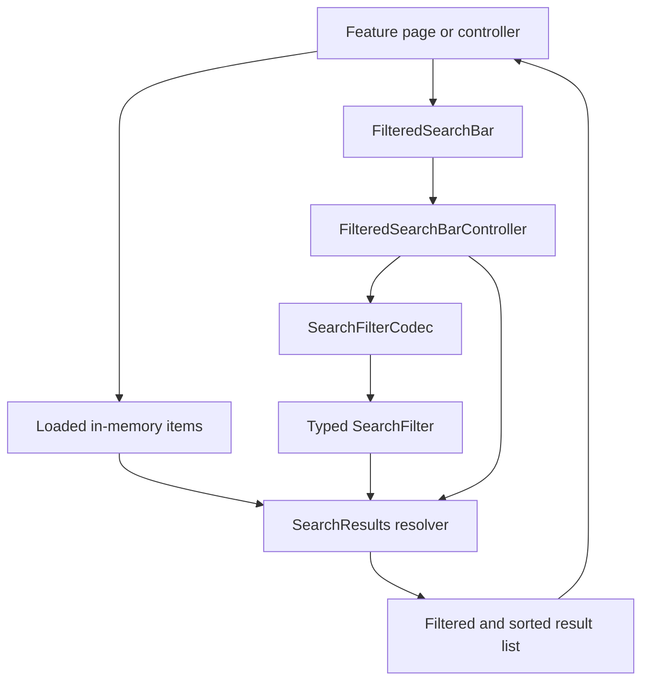
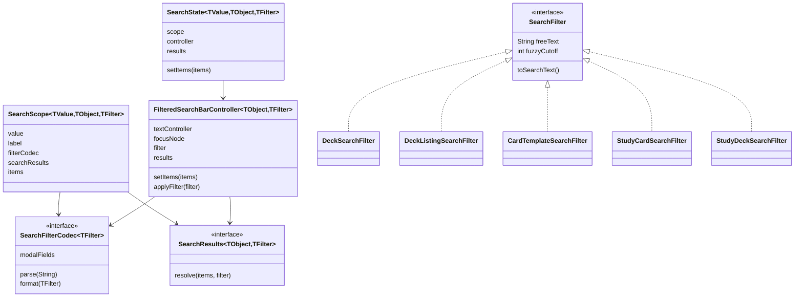
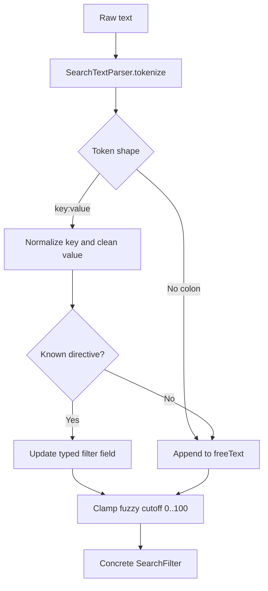
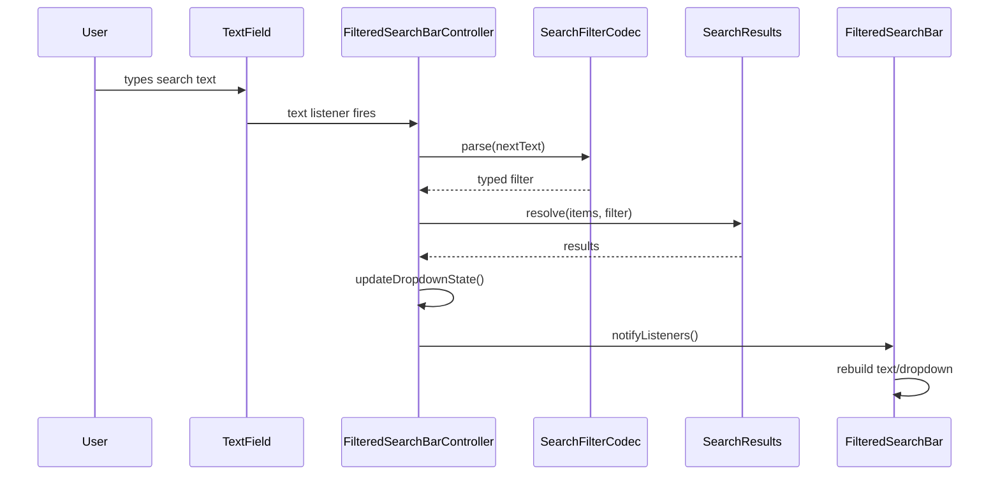
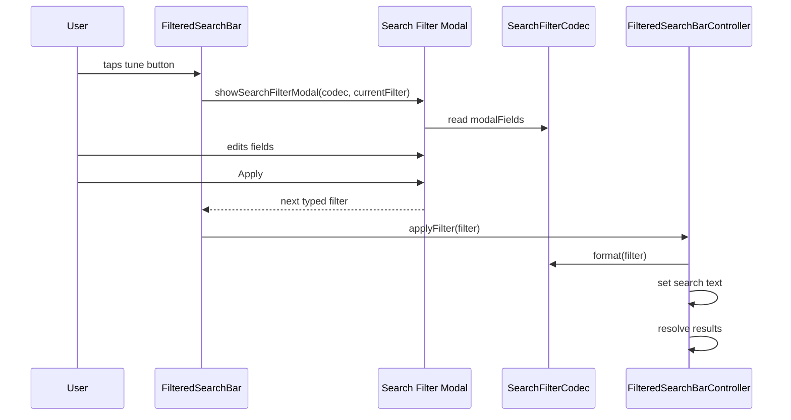
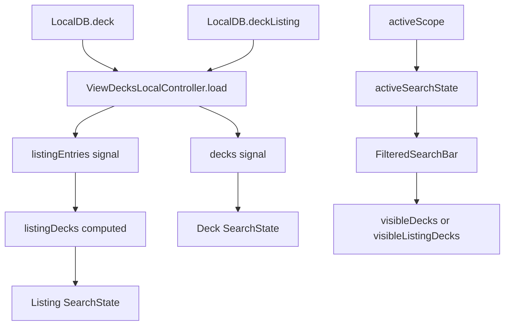
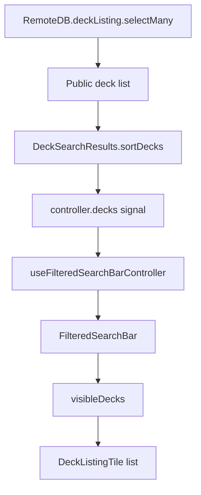
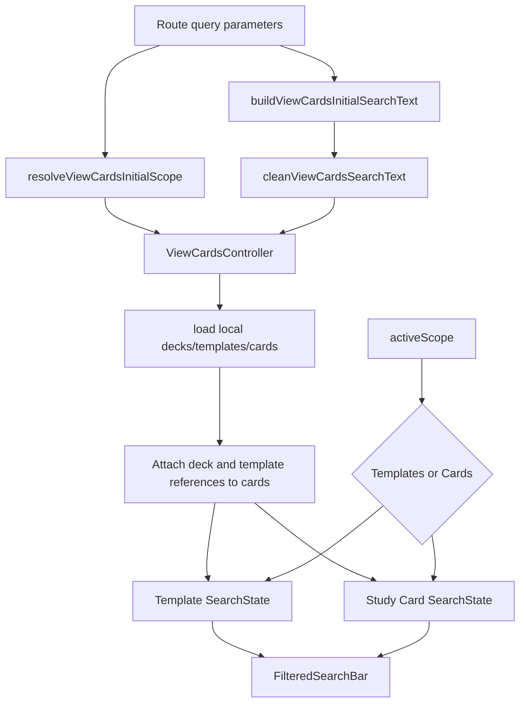
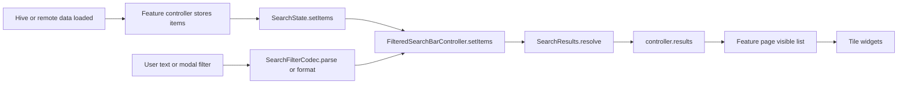
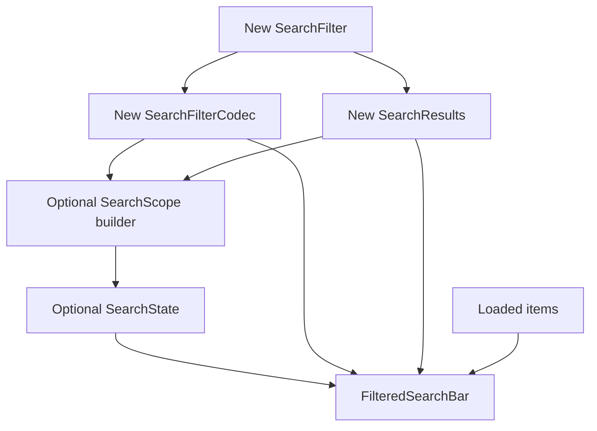

# Search Explanation

This document describes how the current search system works as of September 13, 2026. The code is centered in `lib/features/search/`, with UI wiring in `lib/ui/view_decks/`, `lib/ui/view_deck_listings/`, `lib/ui/view_cards/`, and filter modal UI in `lib/features/search_filter.modal/`.

## Big Picture

Search is an in-memory filtering layer. Callers give it a list of already loaded objects, a typed filter parser, and a typed result resolver. The search bar owns the current text, parses that text into a filter, resolves matching results, and notifies the UI when either the filter or results change.

The system does not query Hive or Supabase by itself. Database adapters and page controllers load data first, then pass the loaded lists into a search controller.

## File Map

`lib/features/search/` is organized by responsibility:

| Area | Files | Responsibility |
| --- | --- | --- |
| Package exports | `search.barrel.dart` | Re-exports the search feature so other barrels/pages can import it through `lib.barrel.dart`. |
| Shared model contracts | `models/search_filter.dart`, `models/search_filter_codec.dart`, `models/search_filter_directive.dart`, `models/search_scope.dart`, `models/search_sort_direction.dart` | Define the generic interfaces and small value objects used by every search domain. |
| Parsing helpers | `search_text_parser.dart`, `search_directive_property.dart` | Tokenize raw search text, clean values, split comma lists, and normalize directive keys. |
| Search state and UI glue | `search_state.dart`, `widgets/filtered_search_bar.controller.dart`, `widgets/filtered_search_bar.hook.dart`, `widgets/filtered_search_bar.dart`, `search_result_tile.dart` | Hold live text/filter/results state, connect it to Flutter widgets, and render the dropdown. |
| Filter definitions | `filters/*.search_filter.dart` | Parse text into domain-specific filter objects and format filters back into directive text. |
| Filter codecs | `filter_codecs/*.search_filter_codec.dart` | Connect each filter object to the reusable parser/formatter contract and describe modal fields. |
| Result resolvers | `results/*.search_results.dart` | Apply exact filters, fuzzy matching, and sorting to in-memory item lists. |
| Sort enums | `sort_fields/*.search_sort_field.dart` | Define supported sort fields for decks, deck listings, and card templates. |
| Small joined models | `models/deck_listing_with_content.dart` | Provides the record shape used by deck-listing search. |

The filter modal lives beside search but outside `lib/features/search/`:

| Area | Files | Responsibility |
| --- | --- | --- |
| Modal shell | `lib/features/search_filter.modal/search_filter.modal.dart` | Opens the modal, orders fields, and returns the applied filter. |
| Modal field contract | `lib/features/search_filter.modal/search_filter.modal_field.dart` | Defines how codec-provided fields build editor widgets. |
| Modal editors | `lib/features/search_filter.modal/search_filter.modal_editors.dart` | Provides text, chip, boolean, enum, and slider editors. |
| Field layout | `lib/features/search_filter.modal/search_filter.modal_field_shell.dart` | Provides the label/layout wrapper for each field. |

## Core Types

`SearchFilter` is the shared contract for every filter type. A filter must expose `freeText`, `fuzzyCutoff`, and `toSearchText()`. The concrete filter classes hold domain-specific directives, such as deck ids, tag names, sort fields, or due windows.

`SearchFilterCodec<TFilter>` bridges text and structured filters. It parses raw text into a typed filter, formats a typed filter back into search text, and describes the modal fields used by the filter button.

`SearchResults<TObject, TFilter>` applies a typed filter to a list of objects. Each implementation decides which fields count as searchable text, which structured filters apply, and how sorting works.

`SearchScope<TValue, TObject, TFilter>` groups the codec, result resolver, label, scope value, and item source for one searchable mode. The UI uses scopes for segmented controls such as "Decks" versus "Listings" or "Templates" versus "Cards".

`SearchState<TValue, TObject, TFilter>` wraps a `SearchScope` and creates the underlying `FilteredSearchBarController`. Feature controllers use it when they need search state to live longer than one widget build.

## Text Parsing

`SearchTextParser.tokenize()` splits the raw search string into tokens. Whitespace separates tokens, but quoted text stays together. Both single and double quotes are supported, and matching wrapping quotes are removed by `cleanValue()`.

Examples:

| Input | Tokens |
| --- | --- |
| `japanese basics` | `japanese`, `basics` |
| `tag:"core grammar"` | `tag:core grammar` |
| `deck:a,b,c` | one token, later split into `a`, `b`, `c` by the filter |

Each filter then scans tokens. A token with no `:` separator becomes free text. A token with `key:value` is treated as a directive if the key matches a directive known to that filter. Unknown directives are preserved as free text instead of being discarded.

Directive keys are normalized by `SearchDirectiveProperty.normalize()`: the key is trimmed, lowercased, and `-` / `_` are removed. This makes `tag_id`, `tag-id`, and `tagid` equivalent for matching.

## Search Bar Runtime Flow

`FilteredSearchBar` is the reusable widget. It renders a text field, an optional filter button, and an overlay dropdown of matching results. It either uses a controller supplied by the caller or creates one through `useFilteredSearchBarController()`.

`FilteredSearchBarController` owns the live search state:

- `textController` stores the visible text.
- `focusNode` controls dropdown visibility.
- `_filter` stores the parsed typed filter.
- `_items` stores the current searchable list.
- `_results` stores the current resolved results.

When the text changes, the controller parses the text through the codec, resolves results through the resolver, updates the dropdown state, and notifies listeners.

The dropdown only appears when the search field has focus, the text is not empty, and the resolved result list is not empty. Result rows use `SearchResultTile` by default, or a custom `resultBuilder` if the caller supplies one. Selecting a result closes the dropdown, unfocuses the field, and calls `onResultSelected`.

## Filter Modal Flow

The tune button in `FilteredSearchBar` opens `showSearchFilterModal()` unless the caller provides a custom modal builder. The modal uses `codec.modalFields`, sorts them by directive order, and renders one editor per field.

Available editor widgets currently are:

| Editor | Purpose |
| --- | --- |
| `SearchFilterTextEditor` | Free text or numeric text input |
| `SearchFilterChipEditor` | Repeated string values such as deck ids or tags |
| `SearchFilterBoolEditor` | Three-state boolean: any, yes, no |
| `SearchFilterEnumEditor` | Segmented enum choices |
| `SearchFilterSliderEditor` | Integer range values, used for fuzzy cutoff |

The important detail is that modal edits become search text. `applyFilter()` formats the typed filter back into directive syntax, then resolves results. This keeps typed UI filters and the visible search query synchronized.

## Fuzzy Matching

Every current result resolver uses the `fuzzywuzzy` package when `freeText` is non-empty. The pattern is:

1. Apply exact structured filters first, such as deck id, tag id, or reversed status.
2. Run `extractAllSorted()` over the remaining choices.
3. Use the filter's `fuzzyCutoff` as the score threshold.
4. Map the fuzzy matches back to their original objects.
5. Sort where that resolver supports sorting.

The default fuzzy cutoff is `60`. Each parser clamps the final value to `0..100`. Lower values allow looser matches; higher values require closer text matches.

## Supported Filters

### Deck Search

Files:

- `filters/deck.search_filter.dart`
- `filter_codecs/deck.search_filter_codec.dart`
- `results/deck.search_results.dart`
- `sort_fields/deck.search_sort_field.dart`

Directives:

| Directive | Aliases | Meaning |
| --- | --- | --- |
| `tag` | `tags`, `#tagName` shorthand | Require decks to contain every named tag |
| `tag_id` | `tagid` | Require decks to contain every tag id |
| `sort` | `field`, `sortby` | Choose `letters`, `createdAt`, or `updatedAt` |
| `direction` | `order`, `dir` | Choose ascending or descending |
| `fuzzy` | `cutoff` | Set fuzzy threshold |

Sort values accepted by `sort:` include:

| Input | Sort |
| --- | --- |
| `latest`, `newest`, `recent`, `updated` | `updatedAt desc` |
| `oldest` | `updatedAt asc` |
| `az`, `a-z`, `letters`, `title`, `name` | `letters asc` |
| `za`, `z-a` | `letters desc` |
| `created`, `date` | `createdAt desc` |

Searched text fields:

- deck title
- short description
- long description
- tag names

Filtering behavior:

- Tag ids and tag names are exact all-of filters.
- Free text uses fuzzy matching against the joined deck text.
- Results are sorted by the requested deck sort field and direction.

### Deck Listing Search

Files:

- `filters/deck_listing.search_filter.dart`
- `filter_codecs/deck_listing.search_filter_codec.dart`
- `results/deck_listing.search_results.dart`
- `models/deck_listing_with_content.dart`
- `sort_fields/deck_listing.search_sort_field.dart`

This search works over `DeckListingWithContent`, a record containing a `DeckListing` and its `Content`.

Directives:

| Directive | Aliases | Meaning |
| --- | --- | --- |
| `deck` | `deckid` | Restrict to one or more deck ids |
| `sort` | `field`, `sortby` | Choose created, updated, downloads, favorites, upvotes, comments, or reviews |
| `direction` | `order`, `dir` | Choose ascending or descending |
| `fuzzy` | `cutoff` | Set fuzzy threshold |

Searched text fields:

- listing deck id
- featured image strings
- values from each featured card

Sorting uses listing metrics for downloads, favorites, upvotes, comments, and reviews. Created and updated sorting use the joined `Content` timestamps.

### Card Template Search

Files:

- `filters/card.template.search_filter.dart`
- `filter_codecs/card.template.search_filter_codec.dart`
- `results/card.template.search_results.dart`
- `sort_fields/card.template.search_sort_field.dart`

Directives:

| Directive | Aliases | Meaning |
| --- | --- | --- |
| `deck` | `deckid` | Restrict to deck ids |
| `template` | `templateid` | Restrict to template ids |
| `tag` | `tags`, `#tagName` shorthand | Require every named tag |
| `tag_id` | `tagid` | Require every tag id |
| `sort` | `field`, `sortby` | Choose sort order, created, or updated |
| `direction` | `order`, `dir` | Choose ascending or descending |
| `fuzzy` | `cutoff` | Set fuzzy threshold |

Searched text fields:

- template id
- deck id
- source template id
- tag names

Filtering behavior:

- Deck ids, template ids, tag ids, and tag names are exact all-of filters where applicable.
- Free text uses fuzzy matching.
- Results are sorted by sort order by default, ascending.

The parser also ignores legacy view-card scope directives named `studycards`, `study_cards`, or `cards`.

### Study Card Search

Files:

- `filters/study_card.search_filter.dart`
- `filter_codecs/study_card.search_filter_codec.dart`
- `results/study_card.search_results.dart`

Directives:

| Directive | Aliases | Meaning |
| --- | --- | --- |
| `deck` | `deckid` | Restrict to deck ids |
| `template` | `templateid` | Restrict to template ids |
| `tag` | `tags`, `#tagName` shorthand | Require every personal tag name |
| `tag_id` | `tagid` | Require every personal tag id |
| `reversed` | `reverse`, `isreversed` | Restrict by card direction |
| `fuzzy` | `cutoff` | Set fuzzy threshold |

Boolean values for `reversed:`:

| Input | Value |
| --- | --- |
| `true`, `yes`, `y`, `1`, `reversed` | `true` |
| `false`, `no`, `n`, `0`, `normal` | `false` |

Searched text fields:

- study card id
- deck id
- template id
- joined deck title, when loaded into the card
- joined template id, when loaded into the card
- personal tag names

Study card search does not apply an additional sort after filtering. It preserves the order of the input list, except when fuzzy search is active, where `extractAllSorted()` orders by fuzzy score.

The parser also ignores legacy view-card scope directives named `studycards`, `study_cards`, or `cards`.

### Study Deck Search

Files:

- `filters/study_deck.search_filter.dart`
- `filter_codecs/study_deck.search_filter_codec.dart`
- `results/study_deck.search_results.dart`

Directives:

| Directive | Aliases | Meaning |
| --- | --- | --- |
| `due` | `threshold`, `filter`, `mode` | Select due window |
| `fuzzy` | `cutoff` | Set fuzzy threshold |

Due values:

| Input | Due filter |
| --- | --- |
| `exact`, `exactandoverdue`, `due`, `now` | `exactAndOverdue` |
| `1h`, `1hour`, `hour`, `onehour`, `lookaheadonehour` | `lookAheadOneHour` |
| `1d`, `1day`, `day`, `oneday`, `lookaheadoneday` | `lookAheadOneDay` |
| `cram`, `all`, `studyall`, `studyallcards`, `cramall` | `cramAll` |

Searched text fields:

- deck title
- deck id
- total due count
- due new count
- due learning count
- due review count
- historical again count
- historical hard count
- historical good count
- historical easy count

Current limitation: `StudyDeckSearchResults.resolve()` only applies free-text fuzzy search. The `dueFilter` is parsed and exposed to the modal, but this resolver does not currently filter items by due window.

## App Integration

### Local Decks

`ViewDecksLocalController` creates two `SearchState<ViewDecksSearchScope, Deck, DeckSearchFilter>` instances:

- deck scope: searches owned decks
- listing scope: searches decks that have local listing entries

Both scopes currently use `DeckSearchFilterCodec` and `DeckSearchResults`, so the "Listings" scope is still deck-shaped search. The controller switches which state is active through `activeScope`.

The controller listens to Hive deck and deck-listing boxes. When local data changes, it reloads and pushes new item lists into the search states. It also increments `searchRevision` when either search controller changes so computed signal values refresh.

### Public Deck Browser

`ViewDeckListingsPage` loads public decks through `ViewDeckListingsController`. The controller calls `RemoteDB.deckListing.selectMany()`, then uses `DeckSearchResults.sortDecks()` to sort the returned decks and `availableTags()` to derive available tags.

The page uses `useFilteredSearchBarController<Deck, DeckSearchFilter>()` directly instead of storing a `SearchState` in the controller.

Current implementation note: the public deck listing page has incomplete controller construction for the deck-listing preview sheet in the current source. That is separate from the reusable search machinery but affects what happens after selecting a public listing tile.

### View Cards

`ViewCardsController` creates one search state for card templates and one for study cards. The initial active scope and search text can come from query parameters.

Query parameters accepted by `buildViewCardsInitialSearchText()`:

- raw search: `filter`, `search`, `q`, `query`
- directive values: `deck`, `deckId`, `template`, `templateId`, `tag`, `tags`, `tagId`, `tagIds`, `reversed`, `fuzzy`, `cutoff`

`resolveViewCardsInitialScope()` chooses study cards when `scope=cards`, `scope=study_cards`, `scope=studycards`, or when `studyCards` is truthy. Otherwise it defaults to templates.

When cards are loaded, the controller builds maps of decks and templates, attaches those references to each `StudyCard` with `copyWith()`, sorts templates and cards into stable input order, and updates both search states. The search results then drive the template/card scope views.

## End-to-End Data Flow

This is the complete path from a user action to rendered results for the common local-controller pattern:

## Notable Behavior and Edges

- Structured filters are exact filters. Fuzzy matching only applies to `freeText`.
- Most exact filters use all-of semantics. For example, multiple tag ids require the item to contain every selected tag id.
- `#tag` shorthand exists for deck, card template, and study card search, but not deck listing search.
- Unknown `key:value` tokens are treated as free text.
- Quoted values work for whitespace, and comma-separated directive values work for multi-value directives.
- `FilteredSearchBar` currently accepts a `placeholder`, but the actual text field placeholder is hardcoded to `Search Here` in the widget.
- `SearchState.hasSearchQuery` checks whether the text is non-empty. Since formatted filters include directives such as `sort:` and `fuzzy:`, a filter-only state counts as a search query.
- Empty free text means no fuzzy pass. The resolver returns the structured-filtered list, then sorts it if that resolver supports sorting.
- The reusable search system does not debounce text input. Every text change parses and resolves synchronously against the current in-memory items.

## Adding a New Search Domain

To add a new searchable object type, the existing pattern is:

1. Create a filter class implementing `SearchFilter`.
2. Define directive constants with `SearchFilterTokenShape`.
3. Implement `parse()` and `toSearchText()`.
4. Create a `SearchFilterCodec` that delegates parse/format and defines modal fields.
5. Create a `SearchResults` resolver that applies structured filters, fuzzy matching, and sorting.
6. Create a `SearchScope` builder if the feature has scoped search.
7. Pass the codec, resolver, items, and optional controller into `FilteredSearchBar`.

