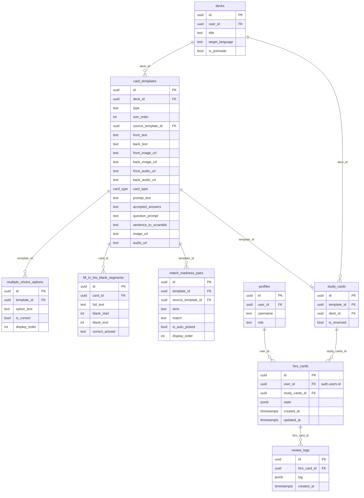

# BooMondai — Card System Reference

> How a flashcard goes from a raw piece of content to a scheduled FSRS review.

---

## The Three Layers

| Layer | Table | Dart DTO | Role |
|---|---|---|---|
| **Blueprint** | `card_templates` | `CardTemplate` subclasses | Stores the raw content and card type |
| **Reviewable unit** | `study_cards` | `StudyCard` | One testable instance per direction (forward / reversed) |
| **FSRS tracker** | `fsrs_cards` | `FsrsCard` | One per user per `study_cards`; holds the scheduling state |

---

## Diagram



---

## How Each Card Type Uses the Wide Table

`card_templates` is a **wide table**: every row has a `type` discriminator and
only the columns relevant to that type are populated. All others are `NULL`.

| `type` | Columns used | Child table rows |
|---|---|---|
| `flashcard` | `front_text`, `back_text`, `front/back_image_url`, `front/back_audio_url`, `card_type` | — |
| `identification` | `prompt_text`, `accepted_answers`, `image_url`, `audio_url` | — |
| `multiple_choice` | `question_prompt`, `image_url`, `audio_url` | `multiple_choice_options` |
| `fill_in_the_blanks` | — | `fill_in_the_blank_segments` |
| `word_scramble` | `sentence_to_scramble`, `image_url`, `audio_url` | — |
| `match_madness` | — | `match_madness_pairs` |

---

## `card_type` Enum (flashcard only)

Controls how many `study_cards` the app generates when a flashcard template is saved.

| Value | Review cards created | What the learner sees |
|---|---|---|
| `normal` | 1 (`is_reversed = false`) | Front → guess Back |
| `reversed` | 1 (`is_reversed = true`) | Back → guess Front |
| `both` | 2 (one of each) | Both directions independently scheduled |

---

## The `state` JSONB (fsrs_cards)

The `state` column is a snapshot of the `fsrs` Dart package's `Card` object,
serialised to JSONB. It is **overwritten in full** on every review.

```json
{
  "due":            "2026-03-26T10:00:00Z",
  "stability":      4.5,
  "difficulty":     5.0,
  "elapsed_days":   1,
  "scheduled_days": 3,
  "reps":           1,
  "lapses":         0,
  "state":          2,
  "last_review":    "2026-03-25T10:02:00Z"
}
```

`state` integer values: `0` = New, `1` = Learning, `2` = Review, `3` = Relearning.

---

## The `log` JSONB (review_logs)

Each row is an **immutable append-only record** of one review event.
It is a snapshot of the `fsrs` package's `ReviewLog` object.

```json
{
  "rating":         3,
  "scheduled_days": 3,
  "elapsed_days":   0,
  "review":         "2026-03-25T10:02:00Z",
  "state":          0
}
```

Rating values: `1` = Again, `2` = Hard, `3` = Good, `4` = Easy.

---

## Full Lifecycle of a Card

```
1. AUTHOR creates a deck and adds a FlashcardTemplate (card_type = both)
        │
        ▼
2. App generates 2 StudyCards:
     study_cards (template_id=X, is_reversed=false, deck_id=Y)
     study_cards (template_id=X, is_reversed=true,  deck_id=Y)
        │
        ▼
3. LEARNER drills the deck → DrillAnswer recorded against card_templates.id
        │  (drill uses the blueprint directly; FSRS not involved yet)
        ▼
4. On drill completion, for each answered card with a self-rating:
     FsrsCard.create(studyCardId, userId)
     → inserts a row into fsrs_cards with a fresh FSRS state (state=0 New)
        │
        ▼
5. FSRS scheduler calculates the next due date and updates fsrs_cards.state
     → appends a row to review_logs (immutable history)
        │
        ▼
6. On each subsequent REVIEW session:
     FsrsProvider loads fsrs_cards WHERE state->>'due' <= now()
     Learner reviews → FsrsCard updated, ReviewLog appended
     Streak.recordActivity() called
```

---

## Key FK Notes

| FK column | Points to | Why |
|---|---|---|
| `card_templates.source_template_id` | `card_templates.id` | Tracks copied templates (e.g. Bob copied Alice's deck) |
| `match_madness_pairs.source_template_id` | `card_templates.id` | Tracks which template a pair was auto-generated from |
| `fill_in_the_blank_segments.card_id` | `card_templates.id` | Named `card_id` to match the `FillInTheBlankSegment` DTO field |
| `fsrs_cards.user_id` | `auth.users.id` | Auth UUID directly — RLS uses `auth.uid()` with no detour through profiles |
| `review_logs.fsrs_card_id` | `fsrs_cards.id` | No `user_id` on review_logs — derive ownership via this join |
