# Stored Media / Sync Refactor Graphs

This companion document visualizes the issues listed in
`stored_media_sync_refactor_review.md`.

The diagrams are intentionally architecture-focused. They are meant to make
coupling, repeated logic, and possible extraction boundaries easier to review.

## Current High-Level Coupling

Deck-sync-specific files should live under `lib/features/sync_deck/`. Generic
helpers and services shown in the target diagrams should live under `lib/core/`
when they are reusable and not owned by one feature.

```mermaid
flowchart TD
    DeckSyncSession["DeckSyncSession"]

    DeckSyncSession --> StrategyFactory["sync strategy construction"]
    DeckSyncSession --> DeckMedia["deck cover media preprocessing"]
    DeckSyncSession --> ListingMedia["deck listing featured media preprocessing"]
    DeckSyncSession --> CardMedia["card-template media preprocessing"]
    DeckSyncSession --> MarkdownRewrite["markdown upload/rewrite"]
    DeckSyncSession --> RemotePaths["remote bucket path strings"]
    DeckSyncSession --> UploadPolicy["stored-media upload predicate"]
    DeckSyncSession --> PublicBucket["PublicBucketRemoteDB"]
    DeckSyncSession --> StoredMediaService["StoredMediaService"]
    DeckSyncSession --> ImageHelper["ImageHelper"]

    CardMedia --> FlashcardTemplate["FlashcardTemplate"]
    CardMedia --> IdentificationTemplate["IdentificationTemplate"]
    CardMedia --> MultipleChoiceTemplate["MultipleChoiceTemplate"]
    CardMedia --> WordScrambleTemplate["WordScrambleTemplate"]
    CardMedia --> FillInTheBlanksTemplate["FillInTheBlanksTemplate"]
    CardMedia --> MatchMadnessTemplate["MatchMadnessTemplate"]

    StrategyFactory --> Decks["Decks"]
    StrategyFactory --> DeckListings["DeckListings"]
    StrategyFactory --> CardTemplates["CardTemplates"]
    StrategyFactory --> StudyCards["StudyCards"]
    StrategyFactory --> FsrsCards["FsrsCards"]
    StrategyFactory --> ReviewLogs["ReviewLogs"]
    StrategyFactory --> SyncDeletions["SyncDeletions"]
```

Problem shown: `DeckSyncSession` is the central node for too many unrelated
concerns.

## Current Media Upload Paths

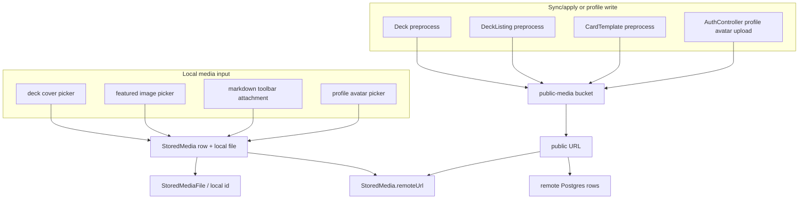

Problem shown: the same upload concept is reached from multiple feature paths,
but upload execution is not centralized enough.

## Duplicate Upload Logic

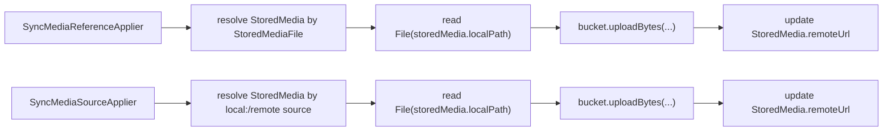

Preferred extraction:

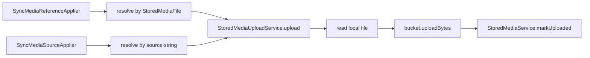

## Current Card-Template Coupling

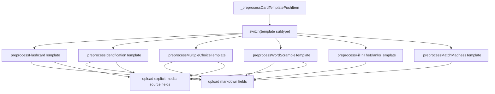

Problem shown: every new card subtype expands the deck sync session.

Descriptor-based alternative:

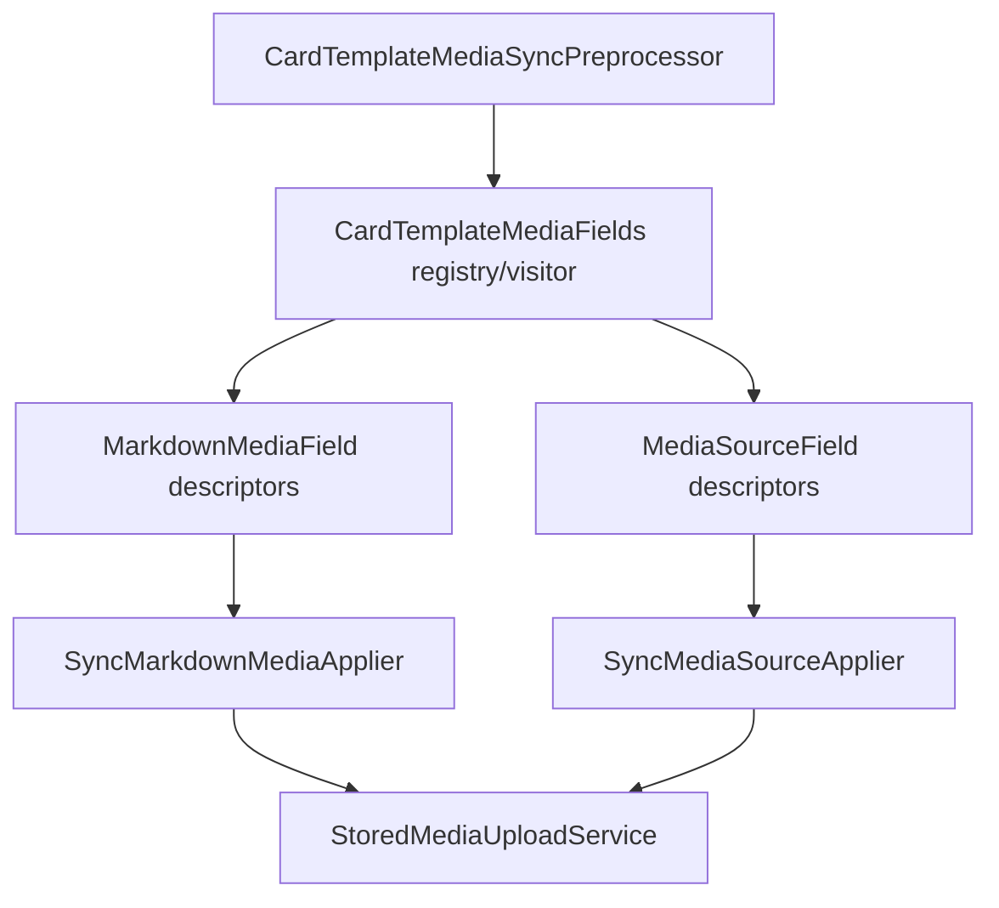

## Current Markdown Attachment Rewrite Flow

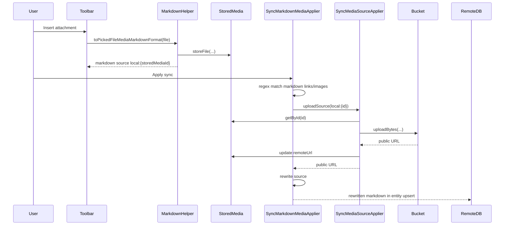

Risk shown: markdown parsing is regex-based, not AST-based.

## Current Profile Avatar Coupling

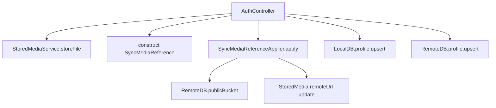

Preferred split:

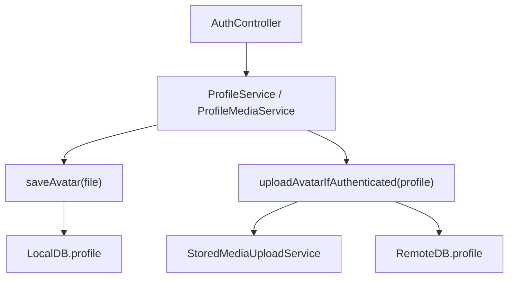

## Bucket Abstraction Decision

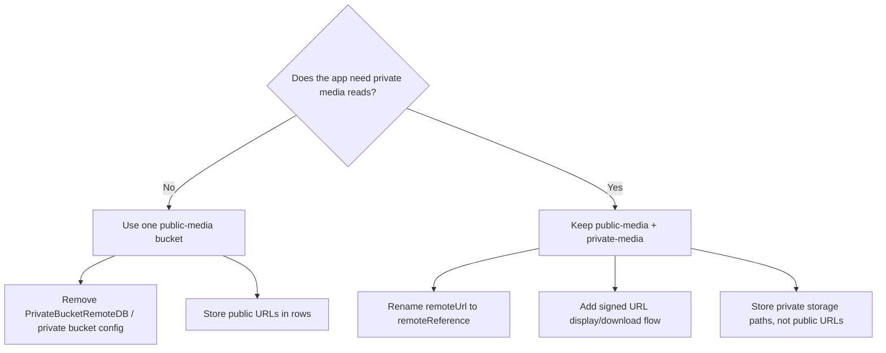

Key rule: RLS folder policies in a public bucket protect writes, not private
reads.

## Local vs Remote Path Coupling

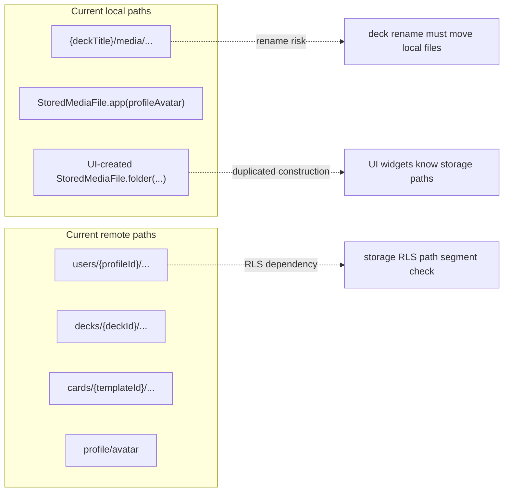

Preferred helpers:

```mermaid
flowchart TD
    DecksDirectoryPaths["DecksDirectoryPaths"]
    MediaRemotePaths["MediaRemotePaths"]

    DecksDirectoryPaths --> LocalDeckCover["deckCover(deckId/title)"]
    DecksDirectoryPaths --> LocalFeatured["deckFeaturedImage(...)"]
    DecksDirectoryPaths --> LocalAttachment["deck/card attachment(...)"]
    DecksDirectoryPaths --> LocalAvatar["profileAvatar(...)"]

    MediaRemotePaths --> RemoteDeckCover["users/{profileId}/decks/{deckId}/cover"]
    MediaRemotePaths --> RemoteFeatured["users/{profileId}/decks/{deckId}/featured/imageN"]
    MediaRemotePaths --> RemoteMarkdown["users/{profileId}/.../markdown/..."]
    MediaRemotePaths --> RemoteAvatar["users/{profileId}/profile/avatar"]
```

## `StoredMediaService` Responsibility Spread

`MediaRemotePaths` and `StoredMediaUploadService` are expected to be core-level
building blocks because they are reusable across deck, card, profile, and future
media features.

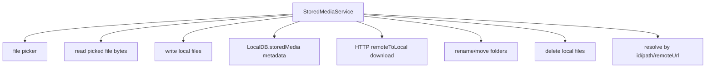

Possible internal split:

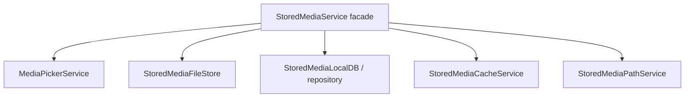

## Sync Preview vs Apply

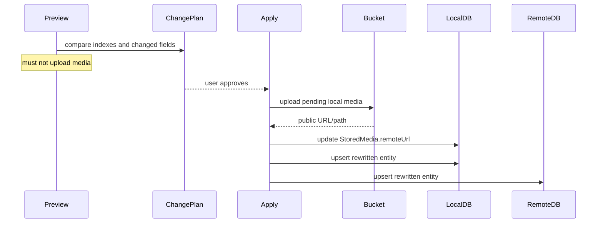

Review question: should preview display "pending media upload" explicitly when
the final URL does not exist yet?

## Media Deletion / Cleanup Gap

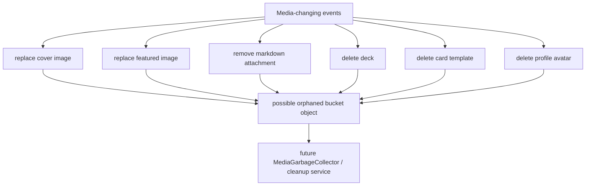

## Proposed Target Architecture

All public files in this target architecture should export through folder
barrels up to `lib.barrel.dart`, and consumers should import from
`lib.barrel.dart` using `show`.

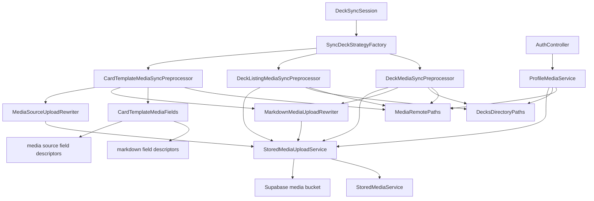

## Suggested Refactor Phases

```mermaid
gantt
    title Stored Media / Sync Refactor Phases
    dateFormat  X
    axisFormat %s

    section Phase 1
    Extract MediaRemotePaths and DecksDirectoryPaths      :p1, 0, 1

    section Phase 2
    Extract StoredMediaUploadService                  :p2, after p1, 1

    section Phase 3
    Move deck/listing/card/profile media logic out    :p3, after p2, 1

    section Phase 4
    Replace card subtype boilerplate with descriptors :p4, after p3, 1

    section Phase 5
    Decide public-only vs public/private buckets      :p5, after p4, 1

    section Phase 6
    Define media deletion and cleanup behavior        :p6, after p5, 1
```
