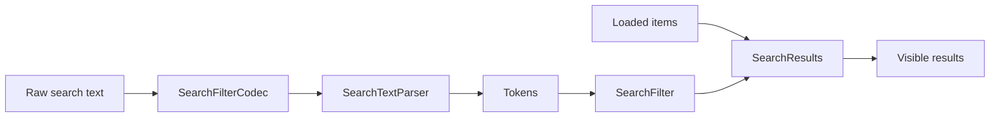
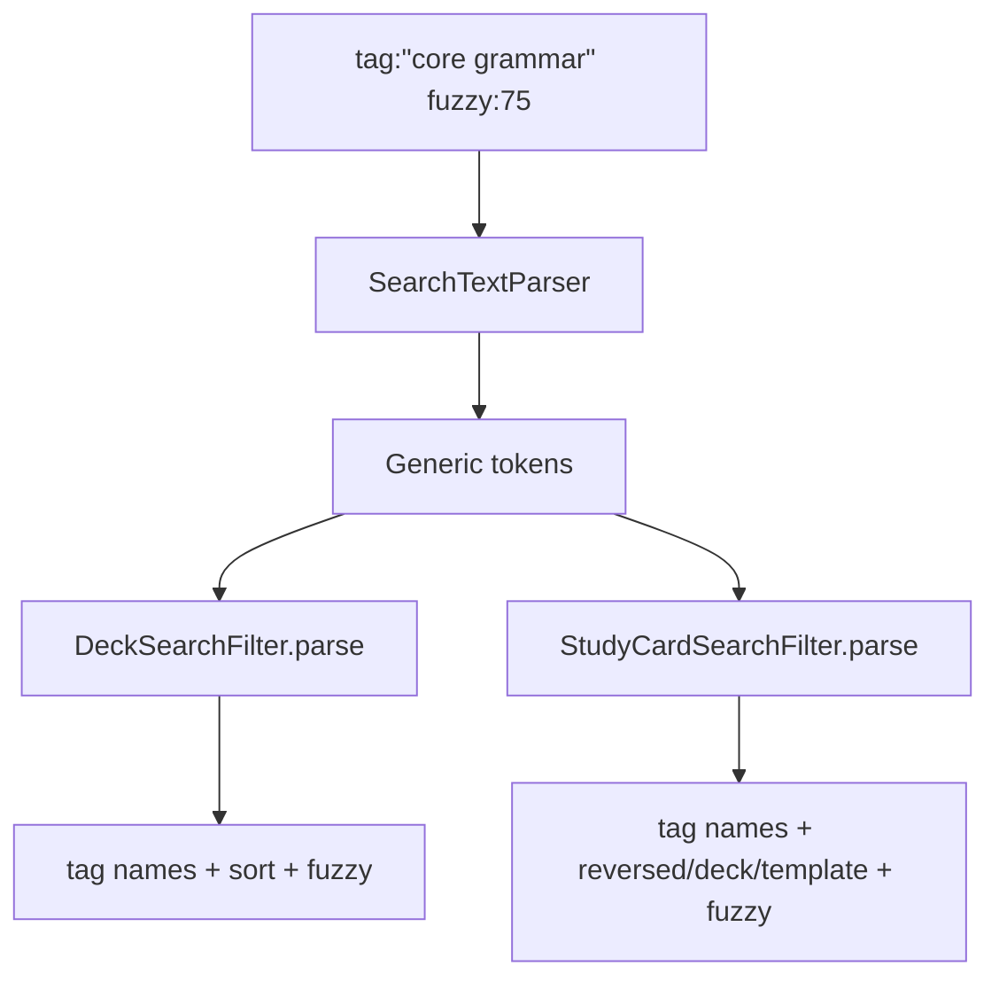
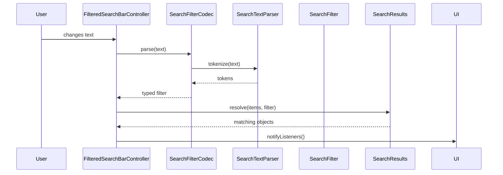
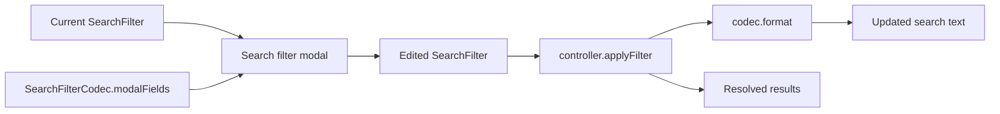
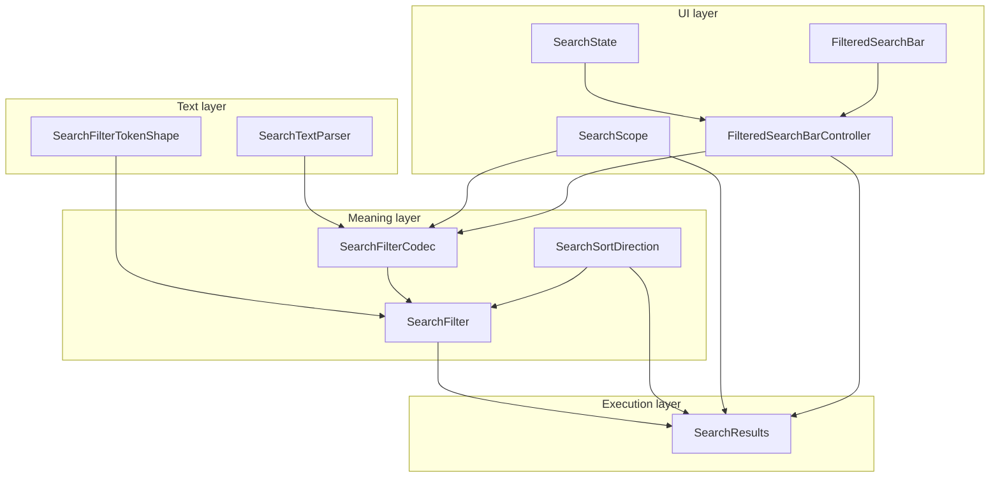

# Search Architecture: How the Pieces Fit Together

The search system is built as a small pipeline. Each type owns one part of the job:



The short version is:

- `SearchTextParser` understands raw text mechanics.
- `SearchFilterTokenShape` defines known directive names and aliases.
- `SearchFilter` stores the parsed meaning of the search.
- `SearchFilterCodec` is the adapter between text/UI and a specific filter type.
- `SearchResults` applies a filter to a list of objects.
- `SearchScope` bundles the codec, result resolver, label, and searchable items for a UI mode.
- `SearchSortDirection` is shared vocabulary for ascending versus descending sort order.

## The Roles

`SearchFilter` is the typed search query. It is not responsible for searching by itself. It only represents what the user asked for after parsing. For example, `DeckSearchFilter` stores `freeText`, selected tag ids, selected tag names, sort field, sort direction, and fuzzy cutoff.

`SearchFilterTokenShape` describes a named piece of filter syntax. A directive has a canonical name, aliases, and an order used by the filter modal. For example, the deck filter has directives like `tag`, `tag_id`, `sort`, `direction`, and `fuzzy`. The directive can answer whether a raw key matches it, including aliases such as `sortby` for `sort`.

`SearchTextParser` is the low-level tokenizer. It knows how to split text into meaningful pieces without understanding decks, cards, tags, due windows, or sorting. It handles things like quotes and comma-separated values.

`SearchFilterCodec<TFilter>` is the bridge for one concrete filter type. It exposes three things:

- `parse(String input)`: turns raw text into a typed filter.
- `format(TFilter filter)`: turns a typed filter back into visible search text.
- `modalFields`: describes how the filter modal should edit that filter.

`SearchResults<TObject, TFilter>` receives already loaded items and a typed filter, then returns the matching objects. This is where actual filtering and sorting happens. For example, `DeckSearchResults` checks tag filters, runs fuzzy matching against deck title/description/tags, then sorts by title, created time, or updated time.

`SearchScope<TValue, TObject, TFilter>` packages a searchable mode. The UI can switch scopes without needing to know all the individual pieces. For example, `ViewCardsSearchScope.templates` uses `CardTemplateSearchFilterCodec` and `CardTemplateSearchResults`; `ViewCardsSearchScope.studyCards` uses `StudyCardSearchFilterCodec` and `StudyCardSearchResults`.

`SearchSortDirection` is only a shared enum: `ascending` or `descending`. It keeps filters/results from each search domain using the same direction type.

## Why Have a Tokenizer If SearchFilterCodec Exists?

Because they work at different levels.

`SearchTextParser` answers: "How should this string be split?"

`SearchFilterCodec` answers: "What does this string mean for this search domain?"

For example:

```text
grammar tag:"core Japanese" sort:updated fuzzy:75
```

The tokenizer can turn that into safe tokens:

```text
grammar
tag:core Japanese
sort:updated
fuzzy:75
```

But the tokenizer should not know that `tag` means deck tag names, or that `sort:updated` maps to `DeckSearchSortField.updatedAt`, or that `fuzzy:75` should be clamped between `0` and `100`. That knowledge belongs to `DeckSearchFilter.parse()`, reached through `DeckSearchFilterCodec.parse()`.

This split keeps the parser generic. Deck search, card template search, study card search, deck listing search, and study deck search all need quote handling and token splitting. They do not all share the same directives or filter fields.



If the tokenizer lived inside every codec, each filter would duplicate the same quote and comma handling. If the tokenizer understood domain directives, it would become coupled to every search feature. The current design keeps text mechanics shared and domain meaning local.

## How a Search Runs

At runtime, `FilteredSearchBarController` coordinates the pieces:



When the user types, the controller parses the text, resolves the results, and notifies the UI. When the item list changes, the controller skips parsing and resolves the existing filter against the new items.

## How the Filter Modal Fits

The filter modal does not invent a separate search format. It edits the same `SearchFilter` object the text field uses.



This is why each codec also owns `modalFields`. The codec already knows how its filter maps to text, so it also supplies the UI controls that edit the same fields. For example, the deck codec exposes a text editor for free text, chip editors for tag names and ids, segmented controls for sort field/direction, and a slider for fuzzy cutoff.

## A Concrete Deck Example

For this input:

```text
grammar #jlpt sort:az fuzzy:70
```

The flow is:

1. `FilteredSearchBarController` sees the text change.
2. `DeckSearchFilterCodec.parse()` delegates to `DeckSearchFilter.parse()`.
3. `DeckSearchFilter.parse()` asks `SearchTextParser.tokenize()` for tokens.
4. The parser returns `grammar`, `#jlpt`, `sort:az`, and `fuzzy:70`.
5. `DeckSearchFilter.parse()` creates:

```text
freeText: grammar
tagNames: {jlpt}
sortField: letters
sortDirection: ascending
fuzzyCutoff: 70
```

6. `DeckSearchResults.resolve()` first keeps only decks tagged `jlpt`.
7. It fuzzy matches `grammar` against deck title, descriptions, and tag names.
8. It sorts the remaining decks alphabetically.
9. The UI reads `controller.results` and renders those decks.

## Where Each Type Sits



## Mental Model

Think of search as four steps:

1. Split the text safely.
2. Interpret the tokens for a specific domain.
3. Apply the typed filter to loaded objects.
4. Show the resulting objects in the current UI scope.

The tokenizer exists for step 1. The codec and filter exist for step 2. `SearchResults` exists for step 3. `SearchScope`, `SearchState`, and `FilteredSearchBar` exist for step 4.
