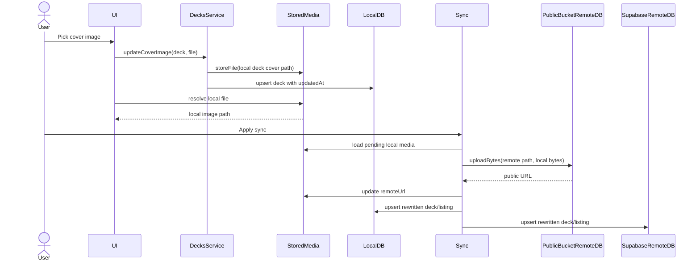
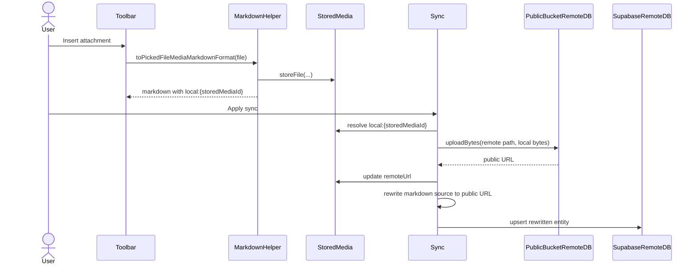

# Supabase Media Sync

This document explains how BooMondai handles local media files, Supabase
Storage buckets, and upload-time media rewriting for deck images, markdown
attachments, card-template media, and profile avatars.

## Purpose

The app is local-first. When a user picks an image, the image should be usable
immediately from local storage. The app should not require a network upload just
to show the edited deck.

When the user later applies sync, local media that belongs to pushed deck data
is uploaded to Supabase Storage. The synced database row stores the Supabase
bucket URL or path, not a local file path.

Profile avatars are the exception to "sync apply" timing: when the user is
authenticated, avatar changes upload before the remote profile row is upserted.
That keeps public profile rows from storing local-only avatar values.

For public media, the intended behavior is:

1. User picks or inserts media.
2. The app writes the file into local stored media.
3. The UI renders the local file immediately through `StoredMedia`.
4. Sync preview sees the owning row as changed through `updatedAt`.
5. Sync apply uploads pending local media to the public bucket.
6. Sync rewrites the pushed entity or markdown text with the uploaded public URL.
7. The local entity is also updated with that public URL.
8. The local stored media entry records the uploaded URL as `remoteUrl`.
9. Future rendering can use the local cached file for that Supabase URL.

## Storage Buckets

Supabase table repositories and Supabase Storage bucket repositories are
separate concepts.

Postgres table access uses `SupabaseRemoteDB<T>` subclasses:

```dart
client.from('decks').upsert(...)
client.from('deck_listings').select(...)
```

Storage bucket access uses `BucketSupabaseRemoteDB` subclasses:

```dart
client.storage.from(bucketName).uploadBinary(...)
```

The bucket repositories live under `lib/core/database/`.

| Class | Bucket | Upload return value | Use case |
|---|---|---|---|
| `PublicBucketRemoteDB` | `Env.publicMediaBucket` | Public URL | Published/shareable media such as deck covers, listing images, markdown attachments, card media, and avatars |
| `PrivateBucketRemoteDB` | `Env.privateMediaBucket` | Storage path | Private media that should be read through signed URLs |

The buckets are created by:

```text
supabase/migrations/20260714002000_16_public_private_media_buckets.sql
```

The migration creates:

| Bucket | Public | Policy shape |
|---|---:|---|
| `public-media` | yes | public read, owner write/delete under `users/{profileId}/...` |
| `private-media` | no | owner read/write/delete under `users/{profileId}/...` |

All app-owned user uploads should use storage paths beginning with:

```text
users/{profileId}/...
```

The RLS policies expect the second path segment to match
`current_profile_id()`.

## Bucket Repository Contract

`BucketSupabaseRemoteDB` defines the common bucket API:

```dart
Future<String> uploadBytes(
  String path,
  Uint8List bytes, {
  String? contentType,
  bool upsert = false,
});

Future<String> uploadImage(
  String path,
  Uint8List bytes, {
  String? contentType,
  bool upsert = false,
});
```

`PublicBucketRemoteDB` overrides this contract and returns a public URL.

`PrivateBucketRemoteDB` overrides the same contract and returns a storage path.
Private media callers should store that path and call `createSignedUrl` when
they need a temporary readable URL.

There are no `uploadPublic*` or `uploadPrivate*` methods. Callers choose the
bucket object, then call `uploadBytes` or `uploadImage`.

## Local Stored Media

Local files are tracked by `StoredMedia`.

Important fields:

| Field | Meaning |
|---|---|
| `id` | Stable local identifier derived from `StoredMediaPath` and file extension |
| `localPath` | File path on the device |
| `remoteUrl` | Uploaded Supabase URL/path associated with this local file |
| `mimeType` | Content type used when uploading |
| `byteSize` | Stored file size |

`StoredMediaPath` gives feature code a semantic way to identify where local
media belongs. For deck media, paths come from `FolderPaths`:

```dart
FolderPaths.deckCoverImage(deck.title).toStoredMediaPath()
FolderPaths.deckListingFeaturedImage(deck.title, index).toStoredMediaPath()
```

These paths are used for local lookup and file persistence.

## Public Media Remote Paths

Public media uploads use stable remote paths based on user/profile id and entity
ids, not mutable display names such as deck title.

Cover image:

```text
users/{userId}/decks/{deckId}/cover
```

Featured image:

```text
users/{userId}/decks/{deckId}/featured/image{index}
```

Deck long-description markdown attachment:

```text
users/{userId}/decks/{deckId}/markdown/{fileName}
```

Card markdown attachment:

```text
users/{userId}/decks/{deckId}/cards/{templateId}/markdown/{field}/{fileName}
```

Card media field:

```text
users/{userId}/decks/{deckId}/cards/{templateId}/{field}/{fileName}
```

Profile avatar:

```text
users/{profileId}/profile/avatar
```

The local stored media path still uses the deck title because the local media
folder is organized by deck title. When a deck title changes,
`StoredMediaService.renameFolderByPrefix` moves the local media folder.

## Rendering Flow

Deck image rendering is local-first.

For cover images, `DecksService.getCoverImageSource` resolves in this order:

1. Local file by deck cover `StoredMediaPath`.
2. Local file associated with `deck.coverImageUrl`.
3. `deck.coverImageUrl`.

For featured images, `DecksService.getListingFeaturedImageSource` resolves in
this order:

1. Local file by featured-image `StoredMediaPath`.
2. Local file associated with the featured image URL at that index.
3. The featured image URL at that index.
4. The deck cover image source.

This means an edited image appears immediately from local disk. After upload,
the same local file can still be used as the cached copy for the Supabase URL.

Markdown media rendering is also local-first.

Markdown attachments are inserted as `local:{storedMediaId}` references:

```markdown

[audio](local:some/stored/audio.mp3)
```

`MarkdownHelper.resolveMediaSourceUri` resolves markdown media in this order:

1. For `local:` URIs, local file by stored media id.
2. For remote URLs, local file associated with that remote URL.
3. The remote URL itself.

After sync rewrites markdown from `local:{storedMediaId}` to a Supabase public
URL, rendering can still use the local cached file because the matching
`StoredMedia.remoteUrl` is updated during upload.

## Edit Flow

When the user changes a deck cover image:

```dart
DecksService.updateCoverImage(...)
```

The service:

1. Stores the picked file at the deck cover local media path.
2. Clears any previous remote association on that local media entry by not
   passing the old remote URL.
3. Updates the deck `updatedAt`.
4. Persists the deck locally.

When the user changes a listing featured image:

```dart
DecksService.updateListingFeaturedImage(...)
```

The service:

1. Stores the picked file at the featured image local media path.
2. Clears any previous remote association on that local media entry.
3. Keeps an existing remote URL in `listing.featuredImages[index]` until sync
   replaces it with the new upload URL.
4. Updates the listing and deck timestamps.
5. Persists both locally.

Keeping the old remote URL in the entity is useful for continuity, but the
stored media entry no longer claims to be associated with that URL. Sync uses
that mismatch to know that a new local file must be uploaded.

When the user inserts a markdown attachment through the toolbar:

```dart
MarkdownHelper.toPickedFileMediaMarkdownFormat(...)
```

The helper:

1. Stores the picked file in `StoredMedia`.
2. Inserts markdown containing a `local:{storedMediaId}` source.
3. Leaves upload to the owning entity's sync/apply step.

When the user changes their profile avatar:

```dart
AuthController.updateAvatarImage(...)
```

The controller:

1. Stores the picked file at `StoredMediaPath.app(name: 'profileAvatar')`.
2. Does not keep the old `remoteUrl` on the new local media entry.
3. Persists the local profile timestamp.
4. If authenticated, uploads the avatar to `public-media`.
5. Rewrites `profile.avatarUrl` to the uploaded public URL.
6. Upserts the remote profile row with the uploaded URL.

## Sync Apply Flow

Deck sync is preview/apply based. Media upload must happen during apply, not
during preview. Preview must not mutate remote storage.

`NewestWinsSyncStrategy` remains generic. It knows how to:

1. Compare local and remote indexes.
2. Build pull/push plans.
3. Apply pulled items.
4. Preprocess pushed items if a preprocessor is supplied.
5. Upsert pushed items.

The strategy does not know about media, files, buckets, or image URLs.

The generic hook is:

```dart
typedef DeckSyncPushItemPreprocessor<T> =
    Future<T> Function(T item, DeckSyncSession context);
```

Deck sync supplies preprocessors for:

| Entity | Preprocessor |
|---|---|
| `Deck` | uploads cover image and rewrites long-description markdown attachments if needed |
| `DeckListing` | uploads featured images if needed |
| `CardTemplate` | uploads explicit card media fields and rewrites markdown attachments in card text fields if needed |

During apply:

```text
local entity
  -> preprocessPushItem
  -> rewritten entity with uploaded media URLs
  -> remote upsert
```

## Media Reference Applier

`SyncMediaReference<T>` describes one uploadable media field.

It contains:

| Field | Purpose |
|---|---|
| `localPath` | Where to find the local stored media |
| `remotePath` | Where to upload inside the selected bucket |
| `bucket` | Bucket repository to use |
| `readValue` | Reads the current entity URL/path |
| `writeValue` | Returns a copy of the entity with the uploaded value |
| `shouldUpload` | Optional custom upload predicate |
| `upsert` | Whether storage upload should overwrite existing object |

`SyncMediaReferenceApplier.apply` performs the actual generic work:

1. Evaluates whether each reference should upload.
2. Loads the local `StoredMedia`.
3. Reads bytes from `StoredMedia.localPath`.
4. Uploads bytes through the reference bucket.
5. Rewrites the entity with the uploaded value.
6. Updates `StoredMedia.remoteUrl`.
7. Persists the rewritten entity if a persistence callback was provided.

The applier is generic over entity type. It does not know about decks or deck
listings.

## Media Source Applier

`SyncMediaSourceApplier` uploads one media source string without requiring a
known `StoredMediaPath`.

It supports:

| Source shape | Lookup |
|---|---|
| `local:{storedMediaId}` | `StoredMediaService.getById` |
| remote URL | `StoredMediaService.getByRemoteUrl` |

This is useful for markdown and card media fields, where the current value is
already a source string rather than a feature-specific local path.

If upload succeeds, it:

1. Uploads local bytes to the selected bucket.
2. Updates `StoredMedia.remoteUrl`.
3. Returns the uploaded bucket value.

If no matching local media exists, it returns the original source unchanged.

## Markdown Media Applier

`SyncMarkdownMediaApplier` rewrites markdown media references during sync apply.

It finds markdown image/link sources:

```markdown

[label](local:stored/audio.mp3)
```

For each uploadable source, it:

1. Delegates upload to `SyncMediaSourceApplier`.
2. Replaces only the source portion of the markdown link/image.
3. Returns rewritten markdown containing Supabase bucket URLs.

This keeps markdown storage portable. Supabase rows do not store device-local
paths or `local:` references after push.

Current sync usage:

| Owner | Markdown fields processed |
|---|---|
| `Deck` | `longDescription` |
| `FlashcardTemplate` | `frontText`, `backText` |
| `IdentificationTemplate` | `promptText` |
| `MultipleChoiceTemplate` | `questionPrompt`, `options.optionText` |
| `WordScrambleTemplate` | `sentenceToScramble` |
| `FillInTheBlanksTemplate` | `segments.fullText` |
| `MatchMadnessTemplate` | `pairs.term`, `pairs.match` |

## Card Template Media

Card templates can have explicit media URL fields in addition to markdown
attachments.

During card-template push preprocessing, these fields are checked and uploaded
through `SyncMediaSourceApplier`:

| Template | Fields |
|---|---|
| `FlashcardTemplate` | `frontImageUrl`, `backImageUrl`, `frontAudioUrl`, `backAudioUrl` |
| `IdentificationTemplate` | `imageUrl`, `audioUrl` |
| `MultipleChoiceTemplate` | `imageUrl`, `audioUrl` |
| `WordScrambleTemplate` | `imageUrl`, `audioUrl` |

The uploaded public URL replaces the field value before the remote
`card_templates` row is upserted.

## Profile Avatar Media

Profile avatars use public media because profile images appear in public or
shared contexts such as listings, comments, reviews, and labels.

Avatar upload is handled before remote profile upsert, not through deck sync.

The profile flow uses the same generic field applier:

```dart
SyncMediaReferenceApplier.apply<Profile>(...)
```

The local path is:

```dart
StoredMediaPath.app(name: 'profileAvatar')
```

The remote path is:

```text
users/{profileId}/profile/avatar
```

`ProfilesRemoteDB` still rejects local-only avatar values. Therefore the profile
write path must upload first and only then call `RemoteDB.profile.upsert(...)`.

## Upload Predicate

For deck media, upload is required when local stored media exists and one of
these is true:

1. The current entity value is empty.
2. The current entity value is not a remote URL.
3. The local stored media `remoteUrl` differs from the current entity value.

This handles the important replacement case:

1. A deck already has a synced cover URL.
2. The user picks a new local cover.
3. The deck still temporarily contains the old remote URL.
4. The local stored media no longer has that `remoteUrl`.
5. Sync sees the mismatch and uploads the new local file.
6. Sync replaces `deck.coverImageUrl` with the new public URL.

## Data Flow Diagram



## Markdown Attachment Flow



## Pulling Remote Media

When downloading a remote deck, remote URLs can be converted back into local
stored media through:

```dart
StoredMediaService.remoteToLocal(...)
```

This downloads the remote URL, stores it locally, and records the remote URL on
the `StoredMedia` row. Once cached, render paths can resolve the local file by
remote URL.

## Important Rules

Do not upload media during sync preview. Preview must stay read-only.

Do not store local filesystem paths in Supabase table rows. Remote rows should
store public URLs for public media or storage paths for private media.

Do not put deck-specific field logic inside bucket repositories. Bucket
repositories only know how to upload/delete/sign objects.

Do not put file/media logic inside `NewestWinsSyncStrategy`. The strategy is
generic sync infrastructure. Feature-specific preprocessors prepare entities
before push.

Use stable remote paths based on ids. Do not use deck titles for bucket paths.

Keep local media paths human/feature-oriented. Renaming a deck can move local
folders without changing already uploaded bucket object paths.

Do not preserve an old remote URL on a newly picked local file. A newly picked
file is pending upload until its own `StoredMedia.remoteUrl` is written after a
successful bucket upload.

## Files To Know

| File | Role |
|---|---|
| `lib/core/database/bucket_supabase.remote.db.dart` | Base bucket repository |
| `lib/core/database/public_bucket.remote.db.dart` | Public bucket repository |
| `lib/core/database/private_bucket.remote.db.dart` | Private bucket repository and signed URLs |
| `lib/features/stored_media/stored_media.service.dart` | Local media persistence and remote-to-local caching |
| `lib/features/stored_media/models/stored_media_path.dart` | Local media path model |
| `lib/core/helpers/folder_paths.helper.dart` | Deck media path helpers |
| `lib/features/sync/models/sync_media_reference.dart` | Generic media-field reference metadata |
| `lib/features/sync/sync_media_reference_applier.dart` | Generic upload-and-rewrite applier |
| `lib/features/sync/sync_media_source_applier.dart` | Generic source-string upload helper for `local:` and cached remote sources |
| `lib/features/sync/sync_markdown_media_applier.dart` | Generic markdown link/image upload and rewrite helper |
| `lib/features/sync/strategies/newest_wins.sync_strategy.dart` | Generic newest-wins sync strategy and push preprocessor hook |
| `lib/features/sync_deck/sync_deck.session.dart` | Deck-specific media preprocessors |
| `lib/features/decks/decks.service.dart` | Local-first deck image resolution and image update methods |
| `lib/features/auth/auth.controller.dart` | Profile avatar local save and authenticated upload-before-upsert path |
| `lib/core/helpers/markdown.helper.dart` | Markdown attachment insertion and local-first media resolution |
| `supabase/migrations/20260714002000_16_public_private_media_buckets.sql` | Public/private bucket setup and policies |

## Operational Checklist

Before relying on deck media upload in an environment:

1. Apply the Supabase migration that creates `public-media` and `private-media`.
2. Confirm uploaded object paths start with `users/{profileId}/...`.
3. Confirm the authenticated user's `current_profile_id()` matches that path.
4. Confirm `RemoteDB.publicBucket` is passed to `DeckSyncSession`.
5. Confirm sync apply, not preview, is used to upload the files.
6. Confirm local media entries update their `remoteUrl` after successful upload.
7. Confirm profile avatar writes upload before `RemoteDB.profile.upsert`.
8. Confirm markdown attachment rows are rewritten from `local:` sources to
   public URLs before remote upsert.
