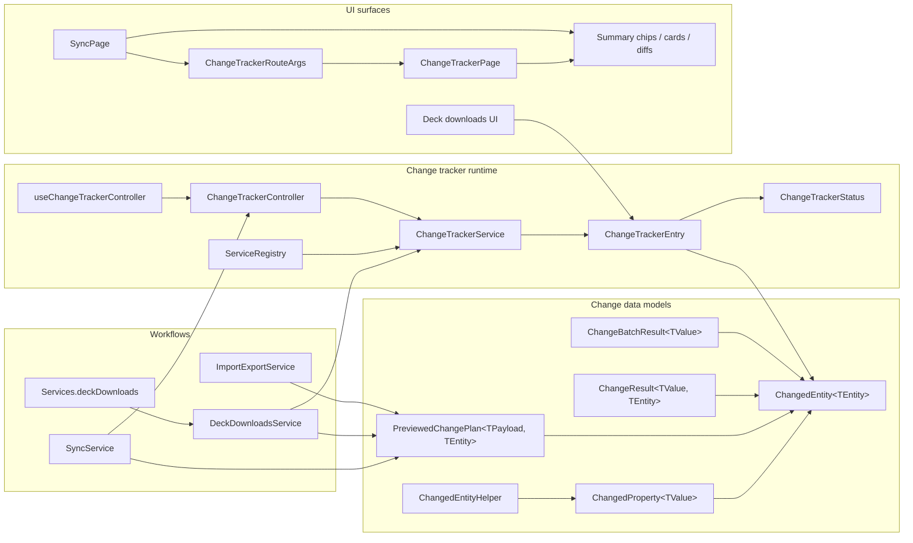
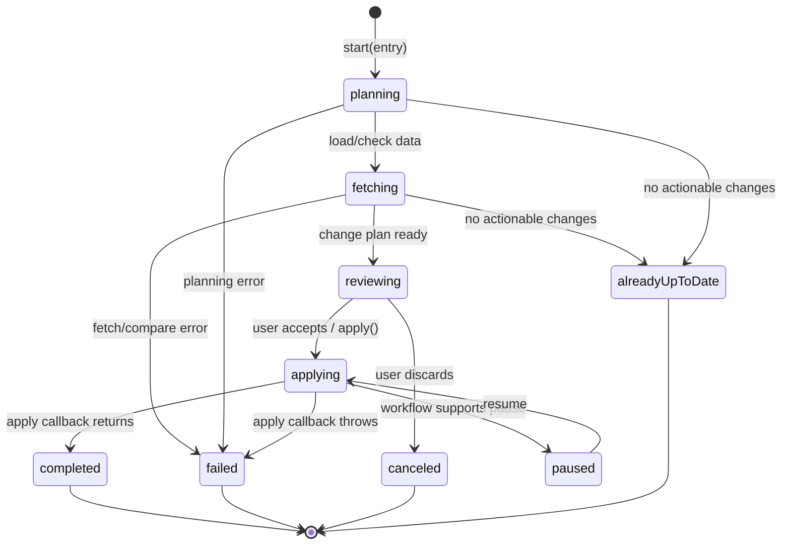
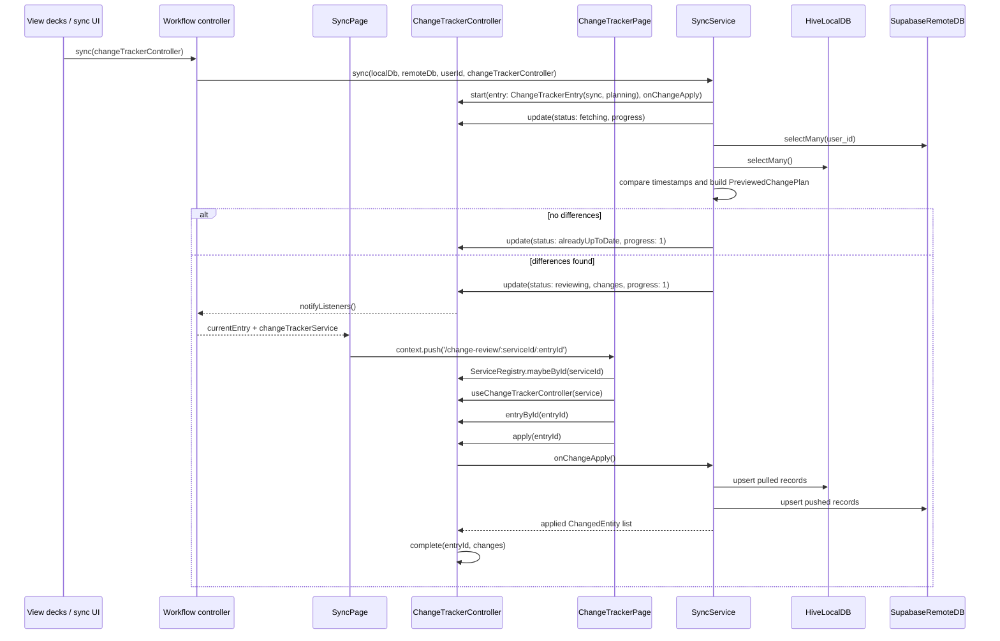
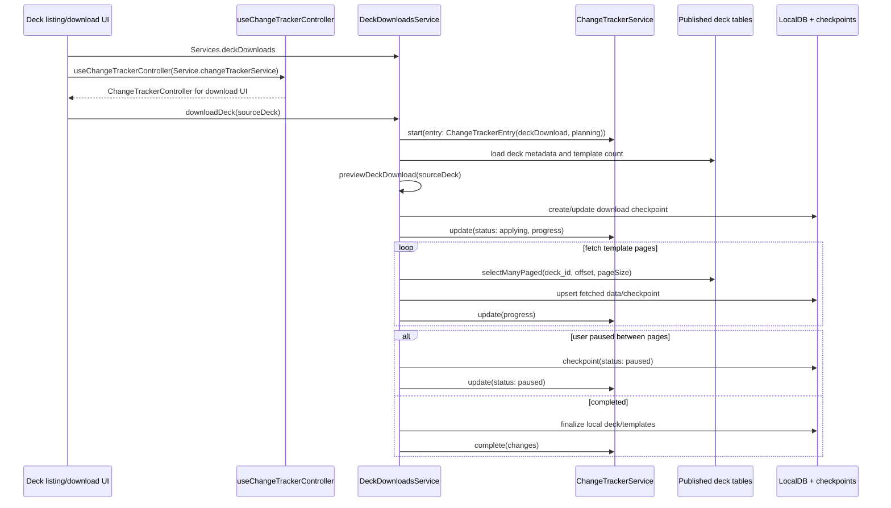

# Change Tracker

The change tracker is the shared review and progress layer for workflows that
need to show users what will change before, during, or after a mutation. It is
implemented in `lib/features/change_tracker/` and currently supports sync, deck
download, and import/export change descriptions.

## Responsibilities

- `ChangedEntity<TEntity>` describes one typed entity-level change, such as
  adding a deck, modifying a card template, or pulling a newer sync row. Its
  `beforeChange` and `afterChange` snapshots use `TEntity`.
- `ChangedProperty<TValue>` describes field-level before/after detail for one
  typed property value.
- `PreviewedChangePlan<TPayload, TEntity>` pairs display-ready change records with the
  typed workflow payload needed to apply the plan later.
- `ChangeResult<TValue, TEntity>` reports the domain result and the typed
  records that were actually applied.
- `ChangeBatchResult<TValue>` reports partial success for batch import/export
  operations, including successful values, human-readable failures, and change
  records from successful items.
- `ChangeTrackerEntry` is the live state for one tracked operation.
- `ChangeTrackerService` owns entries and deferred apply callbacks without
  depending on Flutter UI notification APIs.
- `ChangeTrackerController` adapts a `ChangeTrackerService` for UI listeners.
  `useChangeTrackerController()` creates this adapter around either a default
  in-memory service or a feature-owned service.
- `ChangeTrackerRouteArgs` carries the routed entry id plus the registered
  `ChangeTrackerService.id` so `ChangeTrackerPage` resolves live entries from
  the correct service through `ServiceRegistry`.

## Component Map



## Review-First Lifecycle

The common flow computes a dry-run plan, asks the user to confirm it, then
applies the captured payload.



## Sync Sequence

Sync is the clearest review-first user of the tracker. `SyncService.sync()`
starts an explicit `ChangeTrackerEntry` with an `onChangeApply` callback, builds a
`PreviewedChangePlan<StrategySyncPlanPayload<TContext>, Object?>`, then moves the
entry into review when changes exist. `SyncPage` owns the user actions: it routes to
the change-review page with the registered tracker service id and entry id,
applies the entry, or discards it. The callback closes over the completed plan
and applies the planned `SyncPlanStep`s only after the user confirms.



## Deck Download Sequence

Deck download can use the tracker as a progress surface while the mutation is
already running. The service still emits `ChangedEntity` values, but the entry
may move from planning directly into applying and can pause around persisted
download checkpoints. Unlike sync, deck downloads own their tracker service via
`DeckDownloadsService.changeTrackerService`; UI pages wrap that feature-owned
service with `useChangeTrackerController()` when they need to render download
state.



## UI Consumption

Feature screens create a `ChangeTrackerController` with
`useChangeTrackerController()`. When no service is supplied, the hook creates a
controller around a fresh in-memory `ChangeTrackerService`. Feature-owned
trackers, such as deck downloads, pass their long-lived service into the hook
with `useChangeTrackerController(service: featureService.changeTrackerService)`.

Review routes keep the tracker service id and entry id in the URL. The owning
service is resolved through `ServiceRegistry`, and `ChangeTrackerPage` wraps
that service with the hook before resolving `entryById(entryId)`. If the route
is opened without a registered in-memory service or the entry has been removed,
the page treats it as missing and returns to the previous route.

```mermaid
flowchart TD
    DefaultHook[useChangeTrackerController()]
    FeatureService[Feature service-owned<br/>ChangeTrackerService]
    Registry[ServiceRegistry]
    FeatureHook[useChangeTrackerController(service)]
    Controller[ChangeTrackerController]
    EntryList[entries / activeEntries]
    Entry[entryById(entryId)]
    RouteArgs[ChangeTrackerRouteArgs<br/>serviceId + entryId]
    Page[ChangeTrackerPage]
    Summary[ChangeTrackerSummaryChips]
    Section[ChangedEntitySection]
    Diff[ChangedPropertyBlock]
    Actions[Discard / Looks Good / Back]

    DefaultHook --> Controller
    FeatureService --> FeatureHook
    FeatureService --> Registry
    Registry --> Page
    FeatureHook --> Controller
    Controller --> EntryList
    Controller --> Entry
    RouteArgs --> Page
    Page --> Controller
    Entry --> Page
    Page --> Summary
    Page --> Section
    Section --> Diff
    Page --> Actions
    Actions -->|DISCARD| Controller
    Actions -->|LOOKS GOOD| Controller
```

## Implementation Notes

- Entries are immutable snapshots. Service mutations replace entries and invoke
  registered change listeners; controllers bridge that into
  `notifyListeners()`.
- Entries are newest-first in `ChangeTrackerService.entries` and
  `ChangeTrackerController.entries`.
- Entries record `startedAt` when constructed and `finishedAt` when completed,
  failed, or canceled.
- `start()` takes an explicit `ChangeTrackerEntry`; callers construct the entry
  so the service only registers and tracks it.
- `start()` type-erases stored entries to `Object?` internally while preserving
  the typed entry returned to the caller.
- `ChangedEntity.changedProperties` stores `List<ChangedProperty<Object?>>`
  because a single entity diff can contain heterogeneous field values, such as a
  `String` title, `DateTime` update timestamp, `bool` flag, or list field.
- `apply()` moves the entry to `applying`, runs the registered callback when one
  exists, completes with the callback's applied changes, removes the callback,
  and returns an error object to the controller if the callback fails.
- If no apply callback is registered, `apply()` simply completes the entry. This
  supports workflows like deck download that mutate while reporting progress.
- `activeEntries` includes `planning`, `fetching`, `reviewing`, `applying`, and
  `paused`.
- `clearFinished()` removes terminal entries and any stale apply callbacks.
- `remove()` deletes an entry from memory and removes its pending apply
  callback.
- `cancel()` removes a pending apply callback before marking the entry canceled.
- `fail()` stores user-visible error text and calls the base controller error
  hook through `setError`.
- `pause()` and `resume()` only update tracker state. The owning workflow must
  implement the real pause signal and resume behavior.
- The tracker is not durable storage. If a workflow needs resume behavior, it
  must persist its own checkpoint and then report resumed state back through the
  tracker.
