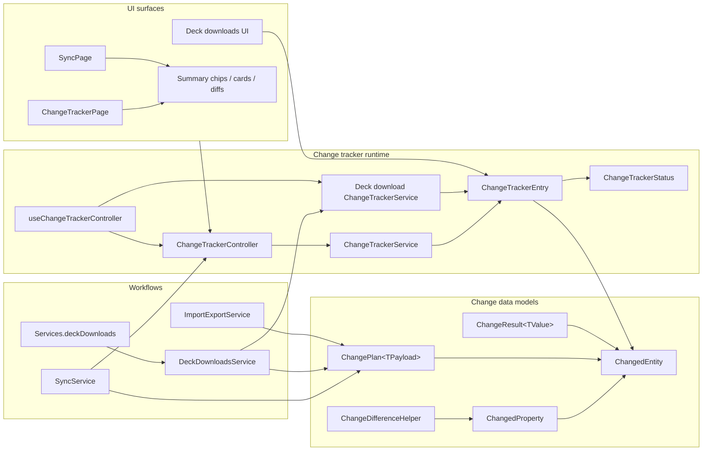
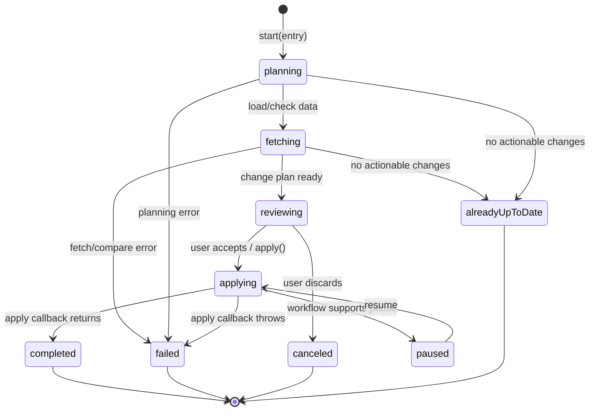
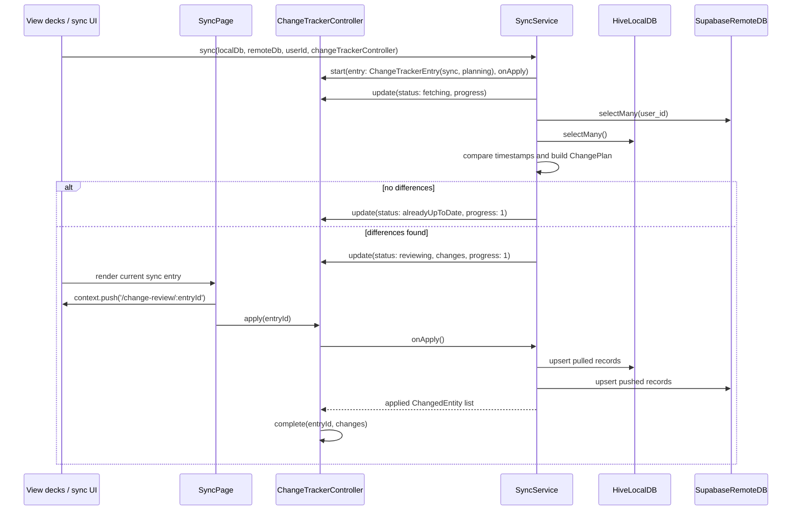
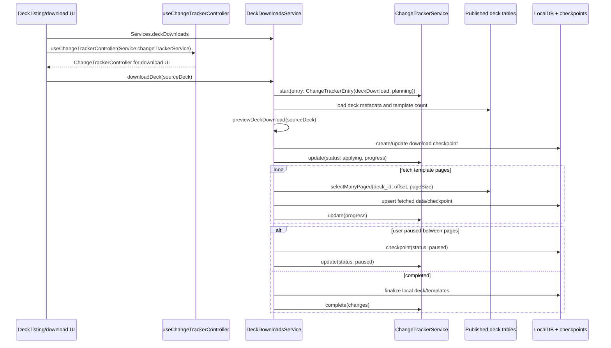

# Change Tracker

The change tracker is the shared review and progress layer for workflows that
need to show users what will change before, during, or after a mutation. It is
implemented in `lib/features/change_tracker/` and currently supports sync, deck
download, and import/export change descriptions.

## Responsibilities

- `ChangedEntity` describes one entity-level change, such as adding a deck,
  modifying a card template, or pulling a newer sync row.
- `ChangedProperty` describes field-level before/after detail for modified
  records.
- `ChangePlan<TPayload>` pairs display-ready change records with the
  workflow payload needed to apply the plan later.
- `ChangeResult<TValue>` reports the domain result and the records that were
  actually applied.
- `ChangeTrackerEntry` is the live state for one tracked operation.
- `ChangeTrackerService` owns entries and deferred apply callbacks without
  depending on Flutter UI notification APIs.
- `ChangeTrackerController` adapts a `ChangeTrackerService` for UI listeners.
  It can be provided globally for routed review flows or created locally with
  `useChangeTrackerController()` around a feature-owned service.

## Component Map



## Review-First Lifecycle

The common flow computes a dry-run plan, asks the user to confirm it, then
applies the captured payload.



## Sync Sequence

Sync is the clearest review-first user of the tracker. `SyncService.sync()`
starts an explicit `ChangeTrackerEntry` with an `onApply` callback, builds
`syncPlan`, then moves the entry into review when changes exist. `SyncPage`
owns the user actions: it routes to the change-review page, applies the entry,
or discards it. The callback closes over the completed plan and calls
`applySync()` only after the user confirms.



## Deck Download Sequence

Deck download can use the tracker as a progress surface while the mutation is
already running. The service still emits `ChangedEntity` values, but the entry
may move from planning directly into applying and can pause around persisted
download checkpoints. Unlike sync, deck downloads own their tracker service via
`DeckDownloadsService.changeTrackerService`; UI pages wrap that feature-owned
service with `useChangeTrackerController()` when they need to render download
state.



## UI Consumption

Some feature screens read the shared controller from Provider. Review routes
resolve an entry by id so they always render the latest immutable entry
instance. Feature-owned trackers, such as deck downloads, create a local
controller with `useChangeTrackerController(service: featureService.tracker)`.

```mermaid
flowchart TD
    Provider[ChangeNotifierProvider<br/>in main.dart]
    FeatureService[Feature service-owned<br/>ChangeTrackerService]
    Hook[useChangeTrackerController]
    Controller[ChangeTrackerController]
    EntryList[entries / activeEntries]
    Entry[entryById(entryId)]
    Page[ChangeTrackerPage]
    Summary[ChangeTrackerSummaryChips]
    Card[ChangeTrackerCard]
    Diff[ChangedPropertyBlock]
    Actions[ChangeTrackerActions]

    Provider --> Controller
    FeatureService --> Hook
    Hook --> Controller
    Controller --> EntryList
    Controller --> Entry
    Entry --> Page
    Page --> Summary
    Page --> Card
    Card --> Diff
    Page --> Actions
    Actions -->|DISCARD| Controller
    Actions -->|LOOKS GOOD| Controller
```

## Implementation Notes

- Entries are immutable snapshots. Service mutations replace entries and invoke
  `onChanged`; controllers bridge that into `notifyListeners()`.
- Entries are newest-first in `ChangeTrackerController.entries`.
- `start()` takes an explicit `ChangeTrackerEntry`; callers construct the entry
  so the service only registers and tracks it.
- `activeEntries` includes `planning`, `fetching`, `reviewing`, `applying`, and
  `paused`.
- `clearFinished()` removes terminal entries and any stale apply callbacks.
- `cancel()` removes a pending apply callback before marking the entry canceled.
- `fail()` stores user-visible error text and calls the base controller error
  hook through `setError`.
- The tracker is not durable storage. If a workflow needs resume behavior, it
  must persist its own checkpoint and then report resumed state back through the
  tracker.
