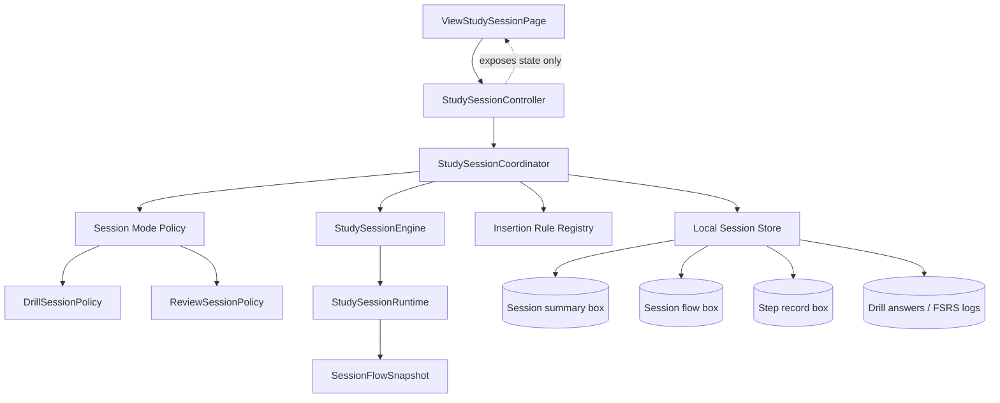
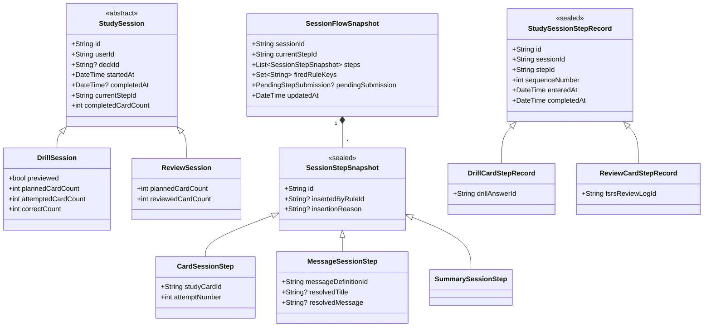
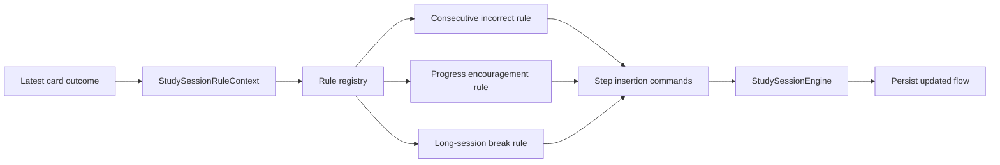
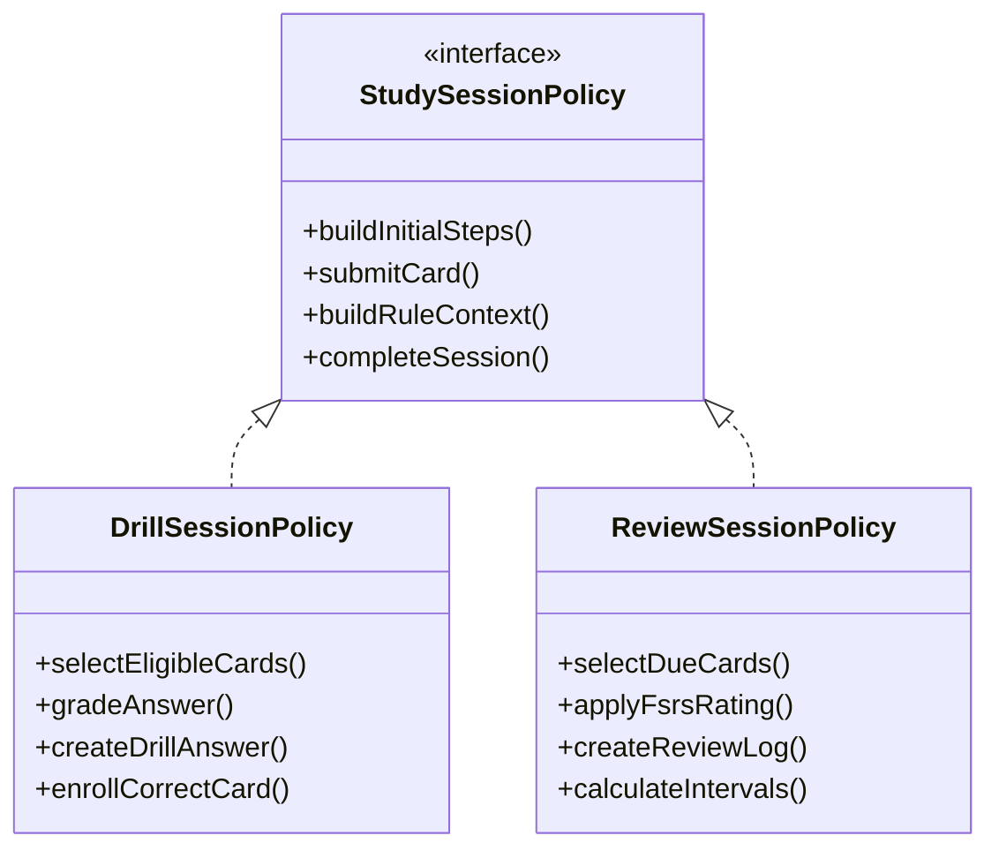
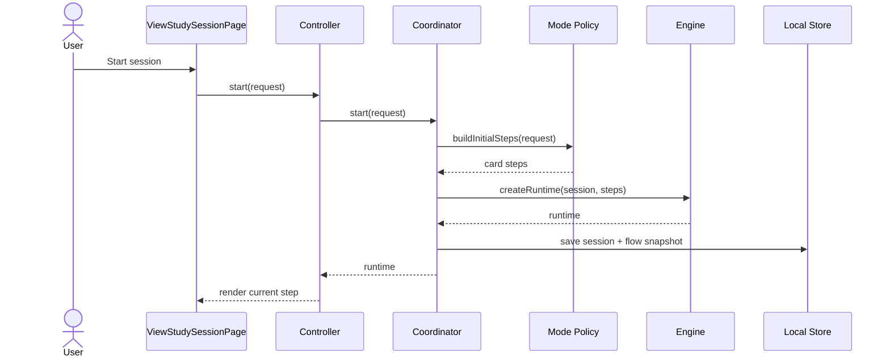
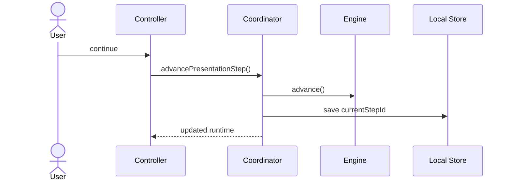
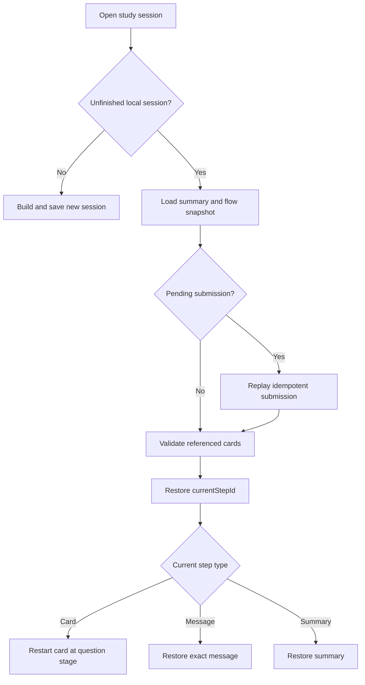

# Study Session Architecture

## Purpose

The study-session feature is an ordered, locally persisted flow. A session may
contain study cards and presentation-only pages such as instructions,
encouragement, breaks, or a summary.

The architecture must support:

- Drill and FSRS review modes.
- One card interaction per session step.
- Dynamic insertion of steps while a session is running.
- Conditional insertion rules with an explicit reason.
- Resuming the exact active step after restarting the app.
- Durable records for learning activity.
- No activity records for presentation-only steps.
- Local-first persistence. Session runtime state is not synchronized remotely.

## Terminology

### Session

A session is the durable summary of one study activity. `DrillSession` and
`ReviewSession` remain mode-specific subclasses of `StudySession`.

### Step

A step is one ordered page in the session flow.

- A `CardSessionStep` presents one card. Question, reveal, and rating are UI
  stages inside the same step.
- A `MessageSessionStep` presents information or encouragement.
- A `SummarySessionStep` presents the completion summary.

The word **segment** is reserved for a future grouping of several steps, such
as an introduction segment or practice segment.

### Flow snapshot

The flow snapshot is the locally persisted runtime state needed to resume a
session. It contains all ordered steps, including presentation-only steps.

### Step record

A step record is durable learning history. Only steps that produce meaningful
domain data create records. Card steps create records; message and summary
steps do not.

Persisting a message in the flow snapshot does not make it a recorded learning
event.

## High-level architecture



### Responsibilities

| Component | Responsibility |
| --- | --- |
| `StudySessionController` | Exposes observable state to Flutter and forwards user intentions. |
| `StudySessionCoordinator` | Coordinates loading, submission, rules, persistence, and completion. |
| `StudySessionEngine` | Performs deterministic flow operations without database or Flutter dependencies. |
| `StudySessionPolicy` | Implements behavior that differs between drill and review modes. |
| `StudySessionInsertionRule` | Decides whether a dynamic step should be inserted. |
| `StudySessionLocalStore` | Reads and writes summaries, snapshots, and records locally. |
| `StudySessionHelper` | Small stateless formatting or template helpers only. |
| `FsrsHelper` | Pure conversion between application ratings and FSRS values. |

Controllers must not directly query `LocalDB`, run FSRS scheduling, or save
answers. Those operations belong to the coordinator, policy, and local store.

## Domain and persistence models



### Session summaries

`DrillSession` and `ReviewSession` are summaries and historical metadata. They
must not own the ordered runtime queue.

Dynamic retry steps make `totalQuestions` ambiguous. Prefer explicit counters:

- `plannedCardCount`: initial unique card steps.
- `attemptedCardCount`: submitted card attempts, including retries.
- `correctCount`: correct drill attempts according to the chosen scoring rule.
- `reviewedCardCount`: submitted FSRS review attempts.

The flow length is not a score denominator because it includes messages and
may change dynamically.

### Flow snapshot

`SessionFlowSnapshot` is the source of truth for resumption:

```dart
@MappableClass()
class SessionFlowSnapshot {
  final String sessionId;
  final String currentStepId;
  final List<SessionStepSnapshot> steps;
  final Set<String> firedRuleKeys;
  final PendingStepSubmission? pendingSubmission;
  final DateTime updatedAt;
}
```

Every step has a stable UUID. Navigation uses `currentStepId`, not only an
integer index. An index becomes unreliable when rules insert steps before or
after the current position.

For presentation steps, store a stable message definition ID. Store resolved
text as well when the content is generated dynamically and must remain
identical after restart.

### Recorded steps

Card steps create `StudySessionStepRecord` values. Presentation-only steps do
not.

The record links the common session flow to the existing mode-specific data:

- `DrillCardStepRecord.drillAnswerId` references `DrillAnswer`.
- `ReviewCardStepRecord.fsrsReviewLogId` references `FsrsReviewLog`.

The `(sessionId, stepId)` pair must be unique. This makes submission
idempotent and prevents duplicate answers if the app restarts during a write.

## Runtime model

`StudySessionRuntime` is an in-memory representation reconstructed from the
session summary and flow snapshot:

```dart
class StudySessionRuntime {
  final StudySession session;
  final List<SessionStepSnapshot> steps;
  final String currentStepId;
  final Set<String> firedRuleKeys;

  SessionStepSnapshot get currentStep;
  int get currentStepIndex;
  bool get isComplete;
}
```

Do not persist Flutter state such as `TextEditingController`, `FocusNode`,
`Widget`, or `BuildContext`.

The card's question, reveal, and rating states remain one `CardSessionStep`.
An incomplete card resumes at its question stage. A submitted card resumes at
the next persisted step.

## Dynamic insertion rules

Rules are executable application logic registered in code. Closures and
functions are never serialized.



### Rule contract

```dart
abstract interface class StudySessionInsertionRule {
  String get id;

  List<SessionFlowCommand> evaluate(StudySessionRuleContext context);
}
```

The context contains facts, not services:

```dart
class StudySessionRuleContext {
  final SessionMode mode;
  final StudyRating? latestRating;
  final int consecutiveCorrectAnswers;
  final int consecutiveIncorrectAnswers;
  final int completedCardCount;
  final int remainingCardCount;
  final double accuracy;
  final Duration elapsed;
  final Set<String> firedRuleKeys;
}
```

Supported commands should initially be:

```dart
sealed class SessionFlowCommand {}

class InsertAfterCurrent extends SessionFlowCommand {
  final SessionStepSnapshot step;
}

class AppendStep extends SessionFlowCommand {
  final SessionStepSnapshot step;
}

class RequeueCard extends SessionFlowCommand {
  final String studyCardId;
}
```

Rules include why they fired:

```dart
MessageSessionStep(
  id: uuid.v7(),
  messageDefinitionId: 'slow-down',
  insertedByRuleId: 'three-incorrect-v1',
  insertionReason: 'Three consecutive incorrect answers',
)
```

### Preventing repeated insertion

A rule firing key identifies one logical occurrence:

```text
three-incorrect-v1:after-step:<step-id>
```

The key is added to `firedRuleKeys` in the same snapshot update as the inserted
step. Re-evaluating after restart therefore cannot insert the same message
twice.

Rules may intentionally fire more than once by producing different occurrence
keys, for example at completed-card counts 5, 10, and 15.

## Mode policies



Shared flow behavior belongs in the engine. Mode-specific learning behavior
belongs in policies.

For example, requeuing an incorrect drill card is a policy decision expressed
as a `RequeueCard` command. Inserting that new card step into the ordered flow
is engine behavior.

## Session lifecycle

### Starting a new session



An optional introduction message can be part of the initial steps. Dynamic
rules are evaluated after meaningful events, not continuously during builds.

### Rendering

```dart
Widget buildCurrentStep(SessionStepSnapshot step) {
  return switch (step) {
    CardSessionStep step => StudyCardStepPage(step: step),
    MessageSessionStep step => StudySessionMessagePage(step: step),
    SummarySessionStep step => StudySessionSummaryPage(step: step),
  };
}
```

Widgets receive data and callbacks. They do not mutate the flow directly.

### Submitting a card

```mermaid
sequenceDiagram
    actor User
    participant C as Controller
    participant O as Coordinator
    participant DB as Local Store
    participant P as Mode Policy
    participant R as Rule Registry
    participant E as Engine

    User->>C: submit(answer, rating)
    C->>O: submitCurrentCard(...)
    O->>DB: save pending submission marker
    O->>P: process card outcome
    P-->>O: outcome + mode record + flow commands
    O->>DB: upsert step record and mode record
    O->>R: evaluate(rule context)
    R-->>O: insertion commands
    O->>E: apply all commands
    O->>E: advance
    O->>DB: save session + snapshot; clear pending marker
    O-->>C: updated runtime
```

### Advancing a presentation step

No activity record is created:



Persisting the new cursor is required because the user may close the app while
viewing either message.

## Crash safety and idempotency

Hive does not provide a transaction spanning several boxes. A card submission
may update a flow snapshot, a step record, a drill answer or review log, an
FSRS card, and the session summary.

Use a recoverable transition:

1. Save `PendingStepSubmission` in the flow snapshot.
2. Upsert the step record and mode-specific record using deterministic IDs.
3. Apply the FSRS or drill side effects idempotently.
4. Advance the flow.
5. Save the updated summary and snapshot with `pendingSubmission: null`.

On resume, the coordinator detects a pending submission and replays it.
Upserts and the unique `(sessionId, stepId)` identity prevent duplicates.

Do not advance the in-memory cursor before the pending submission is durable.

## Local persistence

Add local Hive-backed stores:

```text
study_session_flows
study_session_step_records
```

Existing boxes remain:

```text
drill_sessions
review_sessions
drill_answers
fsrs_review_logs
```

`LocalDB` should expose:

```dart
static late final StudySessionFlowsLocalDB studySessionFlow;
static late final StudySessionStepRecordsLocalDB studySessionStepRecord;
```

No remote database or Supabase schema is required for flow snapshots or step
records. Existing remote session classes should not be used by the runtime
coordinator.

## Resume behavior



If a referenced study card was deleted, the coordinator marks that step
skipped and advances. It must not crash the entire resumable session.

## Progress

Expose distinct progress values:

- **Flow progress:** current position divided by current flow length. Useful
  for page navigation, but it can move backward when steps are inserted.
- **Card progress:** completed initial cards divided by planned initial cards.
  Stable for the primary progress bar.
- **Attempt count:** all submitted card attempts, including retries.

The UI should use card progress as its main progress indicator. Do not include
message steps in the learning score.

## File layout

```text
study_session/
├── controllers/
│   └── study_session.controller.dart
├── documentation/
│   ├── architecture.md
│   └── quick_start.md
├── engine/
│   ├── study_session.engine.dart
│   ├── study_session.runtime.dart
│   └── session_flow.command.dart
├── models/
│   ├── study_session.dto.dart
│   ├── session_flow_snapshot.dto.dart
│   ├── session_step_snapshot.dto.dart
│   ├── study_session_step_record.dto.dart
│   └── pending_step_submission.dto.dart
├── policies/
│   └── study_session.policy.dart
├── rules/
│   ├── study_session_insertion.rule.dart
│   ├── study_session_rule.context.dart
│   └── study_session_rule.registry.dart
├── persistence/
│   ├── study_session_flows.local.db.dart
│   ├── study_session_step_records.local.db.dart
│   └── study_session.local.store.dart
└── widgets/
    ├── study_session.card_step.dart
    ├── study_session.message_step.dart
    └── study_session.summary_step.dart
```

Mode-specific implementations remain in their features:

```text
drill.study_session/
├── drill.study_session.policy.dart
└── models/

review.study_session/
├── review.study_session.policy.dart
└── models/
```

## Migration plan

Implement this incrementally:

1. Add step, snapshot, runtime, engine, and rule models with unit tests.
2. Add local flow and step-record stores.
3. Add a coordinator and make the base controller a thin adapter.
4. Move drill selection, grading, retry, and enrollment into a drill policy.
5. Move due-card selection, FSRS scheduling, and review logging into a review
   policy.
6. Update `ViewStudySessionPage` to render the current step by sealed type.
7. Add resume and pending-submission recovery.
8. Remove obsolete controller queues, direct `LocalDB` writes, and helper-like
   service classes.

During migration, do not maintain two independent queues. Once a mode uses the
new engine, its flow snapshot is the only ordered source of truth.

## Invariants

The implementation must enforce:

1. Every step ID is unique within a session.
2. `currentStepId` references a step in the snapshot unless the session is
   complete.
3. Only card steps create learning activity records.
4. A card step creates at most one record per attempt.
5. Presentation steps never affect accuracy or score.
6. A rule occurrence inserts its steps at most once.
7. Dynamic insertion always persists before the inserted step is displayed.
8. Completed sessions have no pending submission.
9. Restarting during submission cannot create duplicate answers or logs.
10. No runtime flow model contains Flutter objects.
