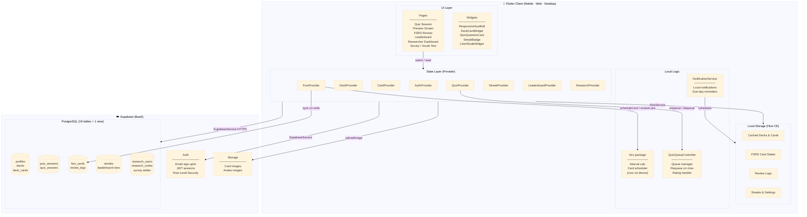

```mermaid
---
config:
  theme: base
---
flowchart TB
    subgraph CLIENT["📱 Flutter Client (Mobile · Web · Desktop)"]
        direction TB

        subgraph UI["UI Layer"]
            direction LR
            PAGES["Pages
            ─────────────
            Quiz Session
            Preview Screen
            FSRS Review
            Leaderboard
            Researcher Dashboard
            Survey / Vocab Test"]
            WIDGETS["Widgets
            ─────────────
            ResponsiveScaffold
            DeckCardWidget
            QuizQuestionCard
            StreakBadge
            LikertScaleWidget"]
        end

        subgraph STATE["State Layer (Provider)"]
            direction LR
            AP["AuthProvider"]
            DP["DeckProvider"]
            CP["CardProvider"]
            QP["QuizProvider"]
            FP["FsrsProvider"]
            SP["StreakProvider"]
            LP["LeaderboardProvider"]
            RP["ResearchProvider"]
        end

        subgraph LOCAL["Local Storage (Hive CE)"]
            direction LR
            HC["Cached Decks & Cards"]
            HF["FSRS Card States"]
            HR["Review Logs"]
            HS["Streaks & Settings"]
        end

        subgraph LOGIC["Local Logic"]
            direction LR
            FSRSLIB["fsrs package
            ──────────
            Interval calc
            Card scheduler
            (runs on-device)"]
            QQ["QuizQueueController
            ──────────
            Queue manager
            Requeue on miss
            Rating handler"]
            NOTIF["NotificationService
            ──────────
            Local notifications
            Due-day reminders"]
        end
    end

    subgraph SUPABASE["☁️ Supabase (BaaS)"]
        direction TB
        AUTH["Auth
        ─────────────
        Email sign-up/in
        JWT sessions
        Row-Level Security"]

        subgraph PG["PostgreSQL (19 tables + 1 view)"]
            direction LR
            UDB[("profiles
            decks
            deck_cards")]
            QDB[("quiz_sessions
            quiz_answers")]
            CDB[("fsrs_cards
            review_logs")]
            LDB[("streaks
            leaderboard view")]
            RDB[("research_users
            research_codes
            survey tables")]
        end

        STORE["Storage
        ─────────────
        Card images
        Avatar images"]
    end

    PAGES -->|"watch / read"| STATE
    STATE -->|"SupabaseService"| AUTH
    STATE -->|"SupabaseService HTTPS"| PG
    STATE -->|"HiveService"| LOCAL
    FP -->|"scheduleCard / reviewCard"| FSRSLIB
    QP -->|"enqueue / dequeue"| QQ
    FP -->|"sync on write"| CDB
    NOTIF -->|"schedules"| LOCAL
    STATE -->|"uploadImage"| STORE
```
