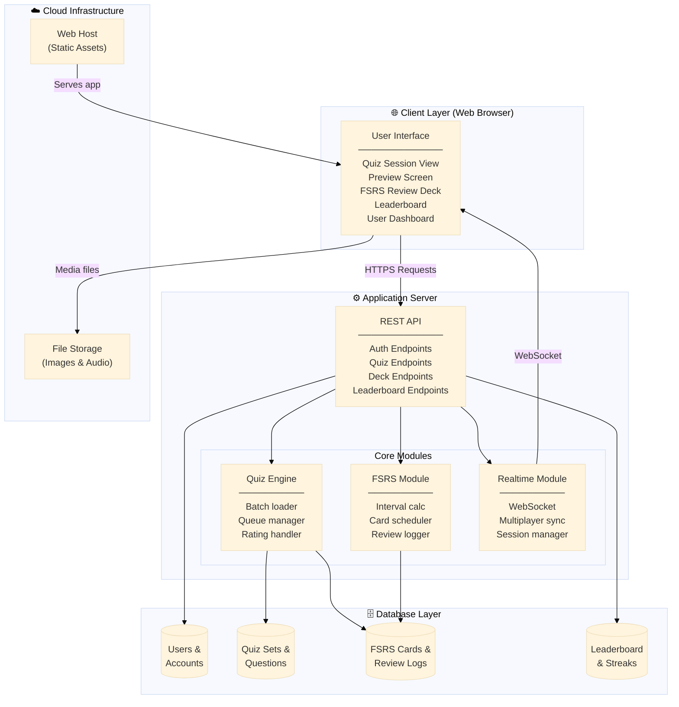

```mermaid
---
config:
  theme: base
---
flowchart TB
    subgraph CLIENT["🌐 Client Layer (Web Browser)"]
        direction TB
        UI["User Interface
        ─────────────
        Quiz Session View
        Preview Screen
        FSRS Review Deck
        Leaderboard
        User Dashboard"]
    end
 
    subgraph SERVER["⚙️ Application Server"]
        direction TB
        API["REST API
        ─────────────
        Auth Endpoints
        Quiz Endpoints
        Deck Endpoints
        Leaderboard Endpoints"]
 
        subgraph MODULES["Core Modules"]
            direction LR
            QE["Quiz Engine
            ──────────
            Batch loader\nQueue manager
            Rating handler"]
            FSRS["FSRS Module
            ──────────
            Interval calc
            Card scheduler
            Review logger"]
            RT["Realtime Module
            ──────────
            WebSocket
            Multiplayer sync
            Session manager"]
        end
 
        API --> QE
        API --> FSRS
        API --> RT
    end
 
    subgraph DB["🗄️ Database Layer"]
        direction LR
        UDB[("Users & 
        Accounts")]
        QDB[("Quiz Sets &
        Questions")]
        CDB[("FSRS Cards &
        Review Logs")]
        LDB[("Leaderboard
        & Streaks")]
    end
 
    subgraph CLOUD["☁️ Cloud Infrastructure"]
        HOST["Web Host
        (Static Assets)"]
        STORE["File Storage
        (Images & Audio)"]
    end
 
    UI -->|"HTTPS Requests"| API
    RT -->|"WebSocket"| UI
    QE --> QDB
    QE --> CDB
    FSRS --> CDB
    API --> UDB
    API --> LDB
    UI -->|"Media files"| STORE
    HOST -->|"Serves app"| UI
```