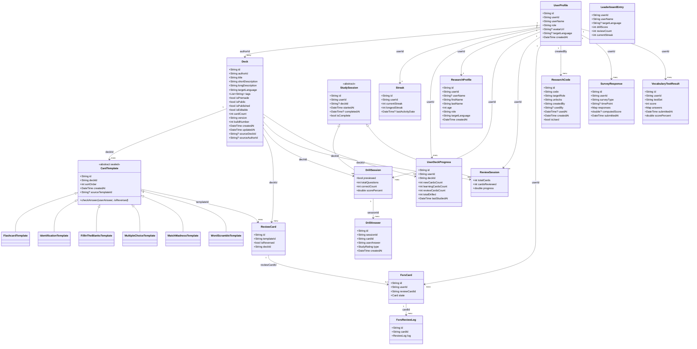

# BooMondai — Architecture Reference

> **Source of truth:** Dart models in `lib/models/`. Schema must conform to them, not the other way around.
> **Last updated:** 2026-04-04

---

## Layer Overview

```
UI (Pages + Widgets)
      │ watch / read
Providers (ChangeNotifier)
      │ call
Services (SupabaseRemoteDB subclasses + HiveService + FsrsService)
      │
LocalDB (thin Hive wrappers for offline cache)
      │
[Supabase DB]   [Local Hive Boxes]
```

---

## Model Layer

### Serialization approach

All models now use `dart_mappable`. This means **all DB tables use camelCase quoted column names**.

| Model | Table / View | Notes |
|---|---|---|
| `UserProfile` | `profiles` | `id` = local UUID; `"userId"` = FK to `auth.users` |
| `Deck` | `decks` | |
| `CardTemplate` subclasses | `card_templates` | Discriminator key: `'type'` |
| `ReviewCard` | `review_cards` | |
| `DrillSession` | `drill_sessions` | Extends `StudySession` (discriminatorKey: `'session_type'`) |
| `ReviewSession` | `review_sessions` | Extends `StudySession` |
| `DrillAnswer` | `drill_answers` | `type` = `StudyRating` enum string |
| `FsrsCard` | `fsrs_cards` | `state` field is a `Card` from the `fsrs` package (JSONB) |
| `FsrsReviewLog` | `review_logs` | `log` = `ReviewLog` from `fsrs` package (JSONB) |
| `UserDeckProgress` | `user_deck_progress` | |
| `Streak` | `streaks` | |
| `LeaderboardEntry` | `leaderboard` (view) | View outputs camelCase aliases |
| `ResearchCode` | `research_codes` | |
| `ResearchProfile` | `research_profiles` | Was `ResearchUser`; added `firstName`, `lastName`, `age` |
| `SurveyResponse` | `survey_responses` | Single generic table with JSONB `responses` |
| `VocabularyTestResult` | `vocabulary_test_results` | |

> **Important:** `dart_mappable` generated mappers use the exact Dart field name as the JSON/DB key. All DB columns use double-quoted camelCase (`"userName"`, `"targetLanguage"`, etc.).

> **Internal content tables** (`notes`, `mc_options`, `fitb_segments`, `mm_pairs`) are not directly mapped to a Dart model — they use snake_case internally and are joined/assembled by services.

---

## Class Diagram



---

## Key Model–Schema Changes

### `profiles`
| Old | New | Change |
|---|---|---|
| `id uuid REFERENCES auth.users` | `id uuid` (independent PK) | id is now a local UUID |
| *(missing)* | `"userId" uuid REFERENCES auth.users` | Added; Supabase auth FK |
| `display_name` | `"userName"` | Renamed |
| `email` | *(removed)* | Not in model |
| `avatar_url` | `"avatarUrl"` | Renamed |
| `target_language` | `"targetLanguage"` | Renamed |
| `created_at` | `"createdAt"` | Renamed |
| `updated_at` | *(removed)* | Not in model |

### `decks`
| Old | New | Change |
|---|---|---|
| `creator_id` | `"authorId"` | Renamed |
| `description` | `"shortDescription"` + `"longDescription"` | Split |
| `target_language` | `"targetLanguage"` | Renamed |
| `is_premade` | `"isPremade"` | Renamed |
| `is_public` | `"isPublic"` | Renamed |
| `is_uneditable bool DEFAULT false` | `"isEditable" bool DEFAULT true` | Renamed + logic inverted |
| `card_count` | `"cardCount"` | Renamed |
| `build_number` | `"buildNumber"` | Renamed |
| `source_deck_id` | `"sourceDeckId"` | Renamed |
| *(missing)* | `"sourceAuthorId"` | Added |
| `is_published` | `"isPublished"` | Renamed |
| `created_at` | `"createdAt"` | Renamed |
| `updated_at` | `"updatedAt"` | Renamed |

### `card_templates` (was `deck_cards`)
| Old | New | Change |
|---|---|---|
| `deck_id` | `"deckId"` | Renamed |
| `card_type` | *(removed)* | Handled by `ReviewCard.isReversed` |
| `question_type` | `type` | Renamed; discriminator key |
| `sort_order` | `"sortOrder"` | Renamed |
| `source_card_id` | `"sourceTemplateId"` | Renamed |
| `created_at` | `"createdAt"` | Renamed |

### New table: `review_cards`
Maps to `ReviewCard`. Links a `CardTemplate` to an FSRS tracking unit, with an `isReversed` flag.

### New table: `review_sessions`
Maps to `ReviewSession`. Tracks FSRS review session state (`totalCards`, `cardsReviewed`).

### `drill_sessions` (was `quiz_sessions`)
| Old | New | Change |
|---|---|---|
| `user_id` | `"userId"` | Renamed |
| `deck_id NOT NULL` | `"deckId"` (nullable) | Renamed + made nullable (StudySession.deckId is optional) |
| `total_questions` | `"totalQuestions"` | Renamed |
| `correct_count` | `"correctCount"` | Renamed |
| `started_at` | `"startedAt"` | Renamed |
| `completed_at` | `"completedAt"` | Renamed |

### `drill_answers` (was `quiz_answers`)
| Old | New | Change |
|---|---|---|
| `session_id` | `"sessionId"` | Renamed |
| `card_id` | `"cardId"` | Renamed |
| `user_answer` | `"userAnswer"` | Renamed |
| `is_correct bool` + `self_rating int` | `type text` | Replaced with `StudyRating` enum string |
| `answered_at` | `"createdAt"` | Renamed |

### `fsrs_cards`
| Old | New | Change |
|---|---|---|
| `user_id` | `"userId"` | Renamed |
| `card_id uuid REFERENCES deck_cards` | `"reviewCardId" uuid REFERENCES review_cards` | Renamed + FK target changed |
| `due`, `stability`, `difficulty`, etc. | `state jsonb` | Collapsed into single JSONB |

### `review_logs`
| Old | New | Change |
|---|---|---|
| `card_id uuid REFERENCES deck_cards` | `"cardId" text REFERENCES fsrs_cards` | FK now references fsrs_cards |
| `rating`, `scheduled_days`, etc. | `log jsonb` | Collapsed into single JSONB for `ReviewLog` from fsrs package |
| `created_at` | `"createdAt"` | Renamed |

### `streaks`
| Old | New | Change |
|---|---|---|
| `user_id` | `"userId"` | Renamed |
| `current_streak` | `"currentStreak"` | Renamed |
| `longest_streak` | `"longestStreak"` | Renamed |
| `last_activity_date` | `"lastActivityDate"` | Renamed |
| `updated_at` | `"updatedAt"` | Renamed |

### `research_profiles` (was `research_users`)
| Old | New | Change |
|---|---|---|
| `research_users` | `research_profiles` | Table renamed to match class |
| `user_id` | `"userId"` | Renamed |
| `target_language` | `"targetLanguage"` | Renamed |
| `created_at` | `"createdAt"` | Renamed |
| *(missing)* | `"userName"` | Added |
| *(missing)* | `"firstName"`, `"lastName"`, `age` | Added (new model fields) |

### `research_codes`
| Old | New | Change |
|---|---|---|
| `target_role` | `"targetRole"` | Renamed |
| `created_by` | `"createdBy"` | Renamed |
| `used_by` | `"usedBy"` | Renamed |
| `used_at` | `"usedAt"` | Renamed |
| `created_at` | `"createdAt"` | Renamed |

### `survey_responses` (replaced all per-survey tables)
All individual survey tables (`research_proficiency_screener`, `research_language_interest`, `research_experience_survey`, `research_preview_usefulness`, `research_fsrs_usefulness`, `research_ugc_perception`, `research_sus`) have been **replaced by a single generic table** to match the `SurveyResponse` dart_mappable model.
- `responses jsonb` holds the full item map
- `"computedScore"` holds SUS score or null
- Unique constraint on `("userId", "surveyType", "timePoint")`

### `vocabulary_test_results` (was `research_vocabulary_test`)
| Old | New | Change |
|---|---|---|
| `research_vocabulary_test` | `vocabulary_test_results` | Table renamed to match class |
| `user_id` | `"userId"` | Renamed |
| `test_set` | `"testSet"` | Renamed |
| `submitted_at` | `"submittedAt"` | Renamed |

---

## Research System Flow

```
Researcher creates codes in dashboard (/research)
        │
        ▼
Participant registers → enters onboarding code (/research/code)
        │ redeemCode() → addResearchProfile() → navigate
        ▼
Day 1: Proficiency Screener (/research/survey/proficiency_screener)
        │ auto-chains on submit
        ▼
Day 1: Language Interest (/research/survey/language_interest)
        │ → back to home
        ▼
[Study period — Group A uses BooMondai, Group B uses Anki]
        │
Researcher provides code for vocabulary_test_a
        ▼
Vocabulary Test Set A (/research/test/A)
Experience Survey short_term (/research/survey/experience_survey?timePoint=short_term)
        │
[2–4 weeks]
        │
Vocabulary Test Set B (/research/test/B)
Experience Survey long_term (/research/survey/experience_survey?timePoint=long_term)
UGC Perception (/research/survey/ugc_perception)
[Group A only:] Preview Usefulness, FSRS Usefulness, SUS
```

**Offline-first:** Survey responses and vocabulary test results are stored locally first (Hive) and only synced to Supabase when the user taps the sync button.

**Unlock keys used in `research_codes.unlocks`:**

| Value | Navigates to |
|---|---|
| `onboarding_group_a` | proficiency_screener → language_interest |
| `onboarding_group_b` | proficiency_screener → language_interest |
| `vocabulary_test_a` | /research/test/A |
| `vocabulary_test_b` | /research/test/B |
| `experience_survey_short_term` | /research/survey/experience_survey?timePoint=short_term |
| `experience_survey_long_term` | /research/survey/experience_survey?timePoint=long_term |
| `preview_usefulness` | /research/survey/preview_usefulness |
| `fsrs_usefulness` | /research/survey/fsrs_usefulness |
| `ugc_perception` | /research/survey/ugc_perception |
| `sus` | /research/survey/sus |

---

## Known Gaps / TODO

- Vocabulary test items in `lib/widgets/vocabulary_test/test_items.dart` are placeholder mock data — need real Japanese vocabulary questions for the actual study
- Researcher role is not enforced by a route guard on `/research` — any authenticated user can access the dashboard
- `mockSignIn()` in `AuthProvider` still exists for development; should be removed before production
- Offline sync for research data (survey_responses, vocabulary_test_results) not yet implemented — submissions are stored locally and need a sync button to push to Supabase
- `research_provider.dart` and `leaderboard_provider.dart` have errors due to model updates — need to be fixed
