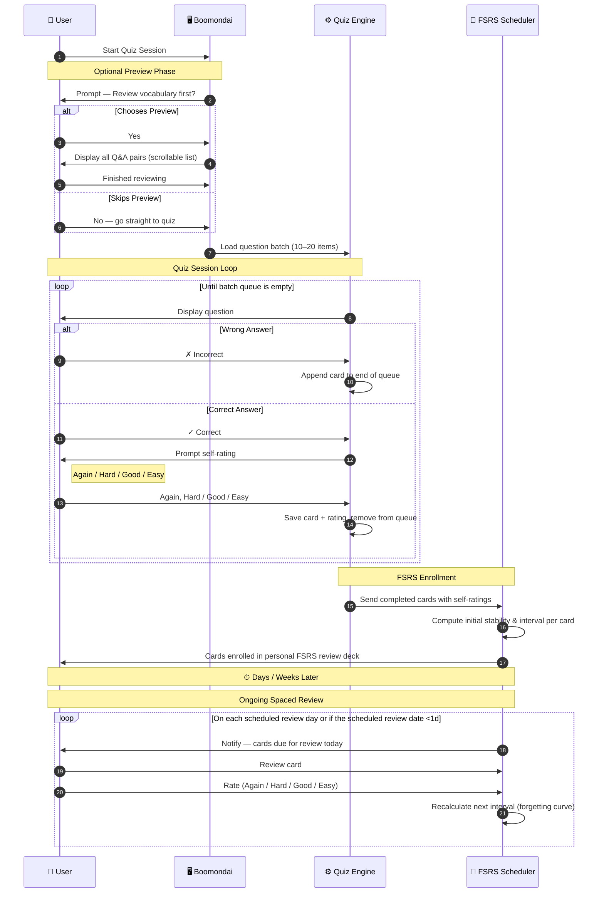

# CALL System
_Call = Computer Assisted Language Learning_

```mermaid
sequenceDiagram
    autonumber
    participant U as 👤 User
    participant BD as 🖥️ Boomondai
    participant QE as ⚙️ Quiz Engine
    participant FS as 🧠 FSRS Scheduler
 
    U->>BD: Start Quiz Session
 

        Note over U,BD: Optional Preview Phase
        BD->>U: Prompt — Review vocabulary first?
        alt Chooses Preview
            U->>BD: Yes
            BD->>U: Display all Q&A pairs (scrollable list)
            U->>BD: Finished reviewing
        else Skips Preview
            U->>BD: No — go straight to quiz
        end

 
    BD->>QE: Load question batch (10–20 items)
 
    
        Note over U,QE: Quiz Session Loop
        loop Until batch queue is empty
            QE->>U: Display question
 
            alt Wrong Answer
                U->>QE: ✗ Incorrect
                QE->>QE: Append card to end of queue
            else Correct Answer
                U->>QE: ✓ Correct
                QE->>U: Prompt self-rating
                note right of U: Again / Hard / Good / Easy
 
                U->>QE: Again, Hard / Good / Easy
                QE->>QE: Save card + rating, remove from queue
            end
        end

 

        Note over QE,FS: FSRS Enrollment
        QE->>FS: Send completed cards with self-ratings
        FS->>FS: Compute initial stability & interval per card
        FS->>U: Cards enrolled in personal FSRS review deck

 
    Note over U,FS: ⏱ Days / Weeks Later
 

        Note over U,FS: Ongoing Spaced Review
        loop On each scheduled review day or if the scheduled review date <1d
            FS->>U: Notify — cards due for review today
            U->>FS: Review card
            U->>FS: Rate (Again / Hard / Good / Easy)
            FS->>FS: Recalculate next interval (forgetting curve)
        end
```
