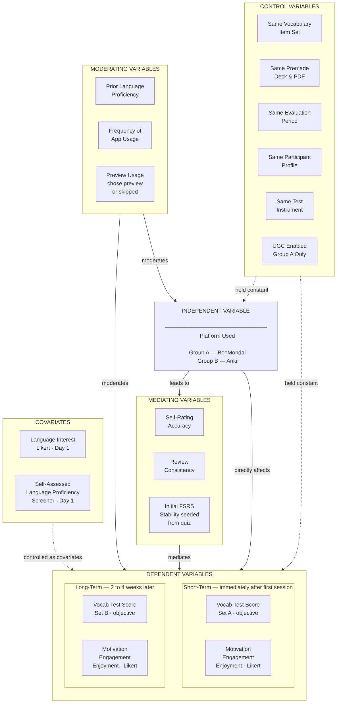

```mermaid
---
config:
  theme: default
---
flowchart TD

  subgraph COV["  COVARIATES  "]
    direction LR
    COV1["Language Interest
    Likert · Day 1"]
    COV2["Self-Assessed
    Language Proficiency
    Screener · Day 1"]
  end

  subgraph MOD["  MODERATING VARIABLES  "]
    direction LR
    M1["Prior Language
    Proficiency"]
    M2["Frequency of
    App Usage"]
    M3["Preview Usage
    chose preview
    or skipped"]
  end

  IV["INDEPENDENT VARIABLE
  ──────────────────────────
  Platform Used

  Group A — BooMondai
  Group B — Anki"]

  subgraph MED["  MEDIATING VARIABLES  "]
    direction LR
    ME1["Self-Rating
    Accuracy"]
    ME2["Review
    Consistency"]
    ME3["Initial FSRS
    Stability seeded
    from quiz"]
  end

  subgraph DV["  DEPENDENT VARIABLES  "]
    direction TB

    subgraph ST["Short-Term — immediately after first session"]
      direction LR
      DV1A["Vocab Test Score
      Set A · objective"]
      DV1B["Motivation
      Engagement
      Enjoyment · Likert"]
    end

    subgraph LT["Long-Term — 2 to 4 weeks later"]
      direction LR
      DV2A["Vocab Test Score
      Set B · objective"]
      DV2B["Motivation
      Engagement
      Enjoyment · Likert"]
    end

  end

  subgraph CTRL["  CONTROL VARIABLES  "]
    direction LR
    C1["Same Vocabulary
    Item Set"]
    C2["Same Premade
    Deck & PDF"]
    C3["Same Evaluation
    Period"]
    C4["Same Participant
    Profile"]
    C5["Same Test
    Instrument"]
    C6["UGC Enabled
    Group A Only"]
  end

  COV  -.->|"controlled as covariates"| DV
  MOD  -->|"moderates"| IV
  MOD  -->|"moderates"| DV
  IV   -->|"leads to"| MED
  MED  -->|"mediates"| DV
  IV   -->|"directly affects"| DV
  CTRL -.->|"held constant"| IV
  CTRL -.->|"held constant"| DV
```