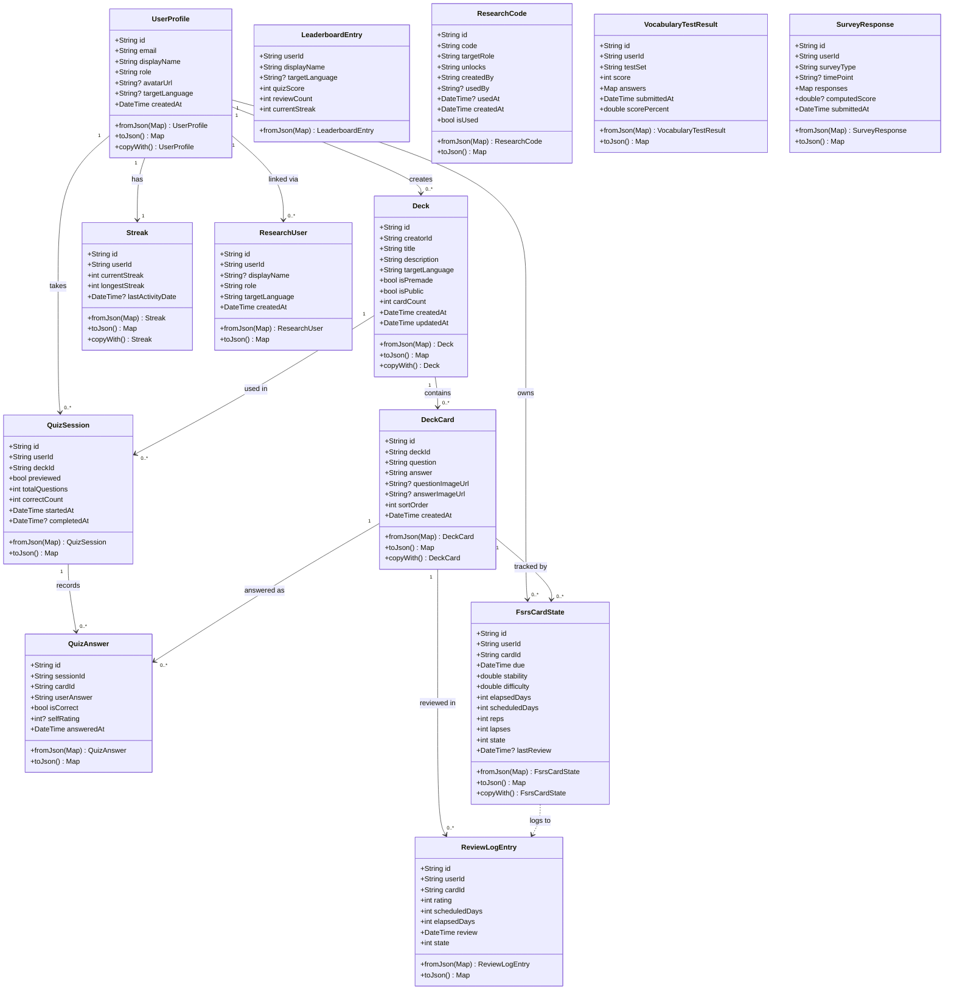

# BooMondai — Class Diagrams

## 1. Data Models

```mermaid
classDiagram
    direction TB

    class UserProfile {
        +String id
        +String email
        +String displayName
        +String role
        +String? avatarUrl
        +String? targetLanguage
        +DateTime createdAt
        +fromJson(Map) UserProfile
        +toJson() Map
        +copyWith() UserProfile
    }

    class Deck {
        +String id
        +String creatorId
        +String title
        +String description
        +String targetLanguage
        +bool isPremade
        +bool isPublic
        +int cardCount
        +DateTime createdAt
        +DateTime updatedAt
        +fromJson(Map) Deck
        +toJson() Map
        +copyWith() Deck
    }

    class DeckCard {
        +String id
        +String deckId
        +String question
        +String answer
        +String? questionImageUrl
        +String? answerImageUrl
        +int sortOrder
        +DateTime createdAt
        +fromJson(Map) DeckCard
        +toJson() Map
        +copyWith() DeckCard
    }

    class QuizSession {
        +String id
        +String userId
        +String deckId
        +bool previewed
        +int totalQuestions
        +int correctCount
        +DateTime startedAt
        +DateTime? completedAt
        +fromJson(Map) QuizSession
        +toJson() Map
    }

    class QuizAnswer {
        +String id
        +String sessionId
        +String cardId
        +String userAnswer
        +bool isCorrect
        +int? selfRating
        +DateTime answeredAt
        +fromJson(Map) QuizAnswer
        +toJson() Map
    }

    class FsrsCardState {
        +String id
        +String userId
        +String cardId
        +DateTime due
        +double stability
        +double difficulty
        +int elapsedDays
        +int scheduledDays
        +int reps
        +int lapses
        +int state
        +DateTime? lastReview
        +fromJson(Map) FsrsCardState
        +toJson() Map
        +copyWith() FsrsCardState
    }

    class ReviewLogEntry {
        +String id
        +String userId
        +String cardId
        +int rating
        +int scheduledDays
        +int elapsedDays
        +DateTime review
        +int state
        +fromJson(Map) ReviewLogEntry
        +toJson() Map
    }

    class Streak {
        +String id
        +String userId
        +int currentStreak
        +int longestStreak
        +DateTime? lastActivityDate
        +fromJson(Map) Streak
        +toJson() Map
        +copyWith() Streak
    }

    class LeaderboardEntry {
        +String userId
        +String displayName
        +String? targetLanguage
        +int quizScore
        +int reviewCount
        +int currentStreak
        +fromJson(Map) LeaderboardEntry
    }

    class ResearchCode {
        +String id
        +String code
        +String targetRole
        +String unlocks
        +String createdBy
        +String? usedBy
        +DateTime? usedAt
        +DateTime createdAt
        +bool isUsed
        +fromJson(Map) ResearchCode
        +toJson() Map
    }

    class ResearchUser {
        +String id
        +String userId
        +String? displayName
        +String role
        +String targetLanguage
        +DateTime createdAt
        +fromJson(Map) ResearchUser
        +toJson() Map
    }

    class VocabularyTestResult {
        +String id
        +String userId
        +String testSet
        +int score
        +Map answers
        +DateTime submittedAt
        +double scorePercent
        +fromJson(Map) VocabularyTestResult
        +toJson() Map
    }

    class SurveyResponse {
        +String id
        +String userId
        +String surveyType
        +String? timePoint
        +Map responses
        +double? computedScore
        +DateTime submittedAt
        +fromJson(Map) SurveyResponse
        +toJson() Map
    }

    %% Relationships
    UserProfile "1" --> "0..*" Deck : creates
    UserProfile "1" --> "0..*" QuizSession : takes
    UserProfile "1" --> "1" Streak : has
    UserProfile "1" --> "0..*" FsrsCardState : owns
    UserProfile "1" --> "0..*" ResearchUser : linked via

    Deck "1" --> "0..*" DeckCard : contains
    Deck "1" --> "0..*" QuizSession : used in

    QuizSession "1" --> "0..*" QuizAnswer : records

    DeckCard "1" --> "0..*" QuizAnswer : answered as
    DeckCard "1" --> "0..*" FsrsCardState : tracked by
    DeckCard "1" --> "0..*" ReviewLogEntry : reviewed in

    FsrsCardState ..> ReviewLogEntry : logs to
```

---

## 2. Providers & Services

```mermaid
classDiagram
    direction TB

    class AuthProvider {
        -SupabaseService _supabase
        -HiveService _hive
        -UserProfile? _userProfile
        -bool _isLoading
        -String? _error
        +UserProfile? userProfile
        +bool isAuthenticated
        +String? role
        +signIn(email, password) Future
        +signUp(email, password, displayName) Future
        +signOut() Future
        +restoreSession() Future
        +clearError()
    }

    class DeckProvider {
        -SupabaseService _supabase
        -HiveService _hive
        -List~Deck~ _decks
        -List~Deck~ _userDecks
        +List~Deck~ decks
        +List~Deck~ premadeDecks
        +fetchDecks() Future
        +fetchUserDecks(userId) Future
        +createDeck(title, desc, lang) Future~Deck~
        +updateDeck(deck) Future
        +deleteDeck(deckId) Future
    }

    class CardProvider {
        -SupabaseService _supabase
        -HiveService _hive
        -List~DeckCard~ _cards
        +List~DeckCard~ cards
        +fetchCards(deckId) Future
        +addCard(deckId, q, a) Future~DeckCard~
        +updateCard(card) Future
        +deleteCard(cardId) Future
        +reorderCards(cards) Future
    }

    class QuizProvider {
        -SupabaseService _supabase
        -HiveService _hive
        -FsrsService _fsrs
        -QuizQueueController _queue
        -QuizSession? _session
        -DeckCard? _currentCard
        -List~QuizAnswer~ _answers
        +QuizSession? session
        +DeckCard? currentCard
        +double progress
        +bool isComplete
        +startSession(deckId, userId, cards, previewed) Future
        +submitAnswer(userAnswer)
        +submitSelfRating(rating) Future
        +completeSession() Future
    }

    class FsrsProvider {
        -FsrsService _fsrs
        -HiveService _hive
        -SupabaseService _supabase
        -List~FsrsCardState~ _dueCards
        -FsrsCardState? _currentCard
        +List~FsrsCardState~ dueCards
        +int dueCount
        +fetchDueCards(userId) Future
        +startReview()
        +submitReview(rating) Future
        +enrollCardsFromQuiz(answers, cards) Future
    }

    class StreakProvider {
        -SupabaseService _supabase
        -HiveService _hive
        -Streak? _streak
        +int currentStreak
        +int longestStreak
        +fetchStreak(userId) Future
        +recordActivity(userId) Future
    }

    class LeaderboardProvider {
        -SupabaseService _supabase
        -List~LeaderboardEntry~ _entries
        -String? _filteredLanguage
        +List~LeaderboardEntry~ entries
        +fetchLeaderboard(targetLanguage?) Future
        +setLanguageFilter(language?)
    }

    class ResearchProvider {
        -SupabaseService _supabase
        -List~ResearchCode~ _codes
        -List~ResearchUser~ _researchUsers
        -List~VocabularyTestResult~ _testResults
        -List~Map~ _experienceSurveyData
        -List~Map~ _susData
        +redeemCode(userId, code) Future~String~
        +generateCode(createdBy, role, unlocks) Future~ResearchCode~
        +submitSurvey(userId, type, timePoint, responses) Future
        +submitVocabularyTest(userId, set, score, answers) Future
        +fetchAllResearchData() Future
    }

    class QuizQueueController {
        -Queue~DeckCard~ _queue
        +int length
        +bool isEmpty
        +DeckCard? current
        +initialize(cards)
        +advance()
        +requeue(card)
    }

    class SupabaseService {
        -SupabaseClient _client
        +signIn(email, password) Future
        +signUp(email, password) Future
        +signOut() Future
        +getProfile(userId) Future
        +upsertProfile(data) Future
        +fetchDecks(publicOnly?) Future
        +insertDeck(data) Future
        +fetchCards(deckId) Future
        +insertCard(data) Future
        +insertQuizSession(data) Future
        +upsertFsrsCard(data) Future
        +insertReviewLog(data) Future
        +fetchLeaderboard(lang?) Future
        +upsertStreak(data) Future
        +fetchResearchCodes() Future
        +redeemResearchCode(code, userId) Future
        +insertSurveyResponse(table, data) Future
        +fetchAllResearchData() Future
        +uploadImage(bucket, path, bytes) Future~String~
    }

    class HiveService {
        +init() Future
        +saveProfile(profile) Future
        +getProfile() UserProfile?
        +saveDecks(decks) Future
        +getDecks() List~Deck~
        +saveCards(deckId, cards) Future
        +getCards(deckId) List~DeckCard~
        +saveFsrsCard(state) Future
        +getFsrsCard(key) FsrsCardState?
        +getDueCards(userId, now) List~FsrsCardState~
        +saveReviewLog(entry) Future
        +saveStreak(streak) Future
        +getStreak(userId) Streak?
        +getNotificationHour() int
        +setNotificationHour(hour) Future
        +clearAll() Future
    }

    class FsrsService {
        +createNewCard() Card
        +scheduleCard(card, rating) SchedulingInfo
        +reviewCard(state, rating) FsrsCardState
        +getDueDate(state) DateTime
    }

    class NotificationService {
        +init() Future
        +scheduleReviewReminder(date, dueCount) Future
        +cancelAll() Future
    }

    %% Provider → Service dependencies
    AuthProvider --> SupabaseService
    AuthProvider --> HiveService
    DeckProvider --> SupabaseService
    DeckProvider --> HiveService
    CardProvider --> SupabaseService
    CardProvider --> HiveService
    QuizProvider --> SupabaseService
    QuizProvider --> HiveService
    QuizProvider --> FsrsService
    QuizProvider --> QuizQueueController
    FsrsProvider --> FsrsService
    FsrsProvider --> HiveService
    FsrsProvider --> SupabaseService
    StreakProvider --> SupabaseService
    StreakProvider --> HiveService
    LeaderboardProvider --> SupabaseService
    ResearchProvider --> SupabaseService
```
