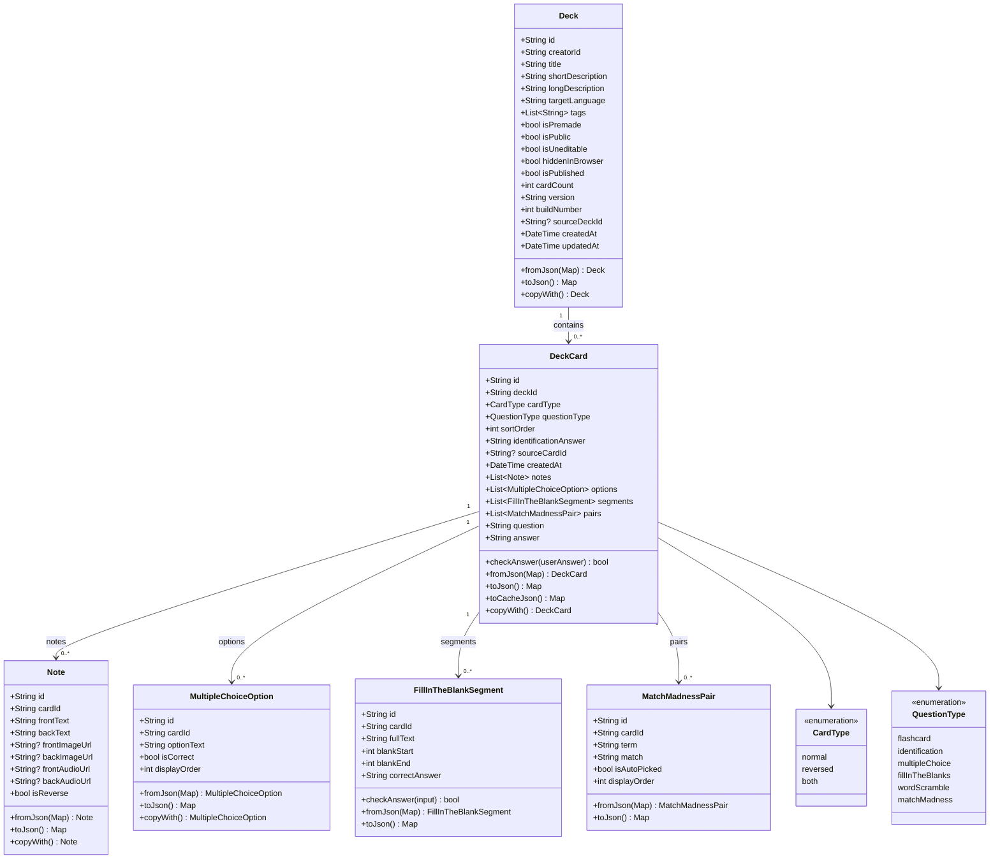
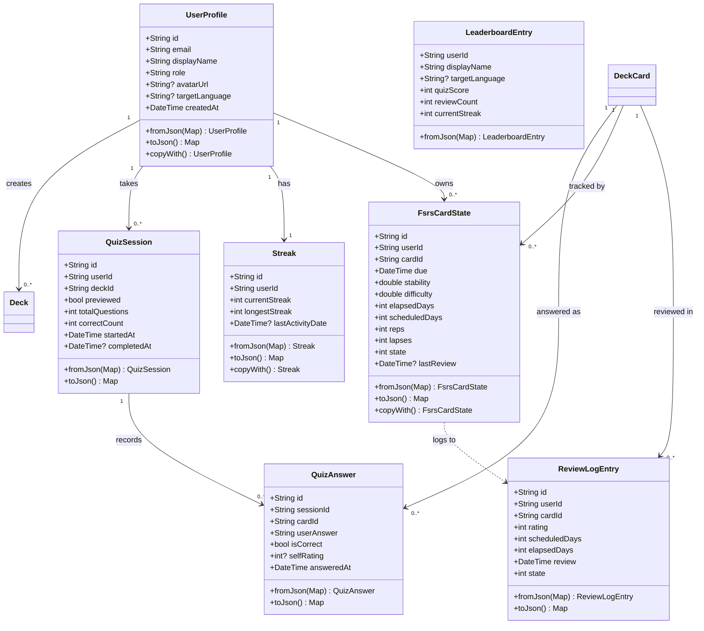

```mermaid
classDiagram
    direction TB

    class DeckProvider {
        -SupabaseService _supabase
        -HiveService _hive
        -List~Deck~ _decks
        -List~Deck~ _userDecks
        +List~Deck~ decks
        +List~Deck~ userDecks
        +List~Deck~ premadeDecks
        +loadFromCache(userId) int
        +fetchDecks() Future
        +fetchUserDecks(userId) Future
        +createDeck(userId, title, desc, lang) Future~Deck?~
        +updateDeck(deck) Future
        +deleteDeck(deckId) Future
        note: deleteDeck is local-first — Hive immediately,\nSupabase best-effort (errors swallowed)
    }

    class CardProvider {
        -SupabaseService _supabase
        -HiveService _hive
        -List~DeckCard~ _cards
        -Set~String~ _dirtyDeckIds
        -bool _isPushing
        +List~DeckCard~ cards
        +String? currentDeckId
        +bool isPushing
        +isDirty(deckId) bool
        +fetchCards(deckId) Future
        +addCard(deckId, cardType, questionType, ...) Future~DeckCard?~
        +updateCard(card) Future
        +deleteCard(cardId) Future
        +reorderCards(cards) Future
        +pushDeck(deckId) Future
        note: add/update/delete/reorder → Hive only\npushDeck → batch sync to Supabase
    }

    class QuizProvider {
        -SupabaseService _supabase
        -HiveService _hive
        -FsrsService _fsrs
        -QuizQueueController _queue
        -QuizSession? _session
        -DeckCard? _currentCard
        -List~QuizAnswer~ _answers
        -Map~String,int~ _wrongCounts
        +QuizSession? session
        +DeckCard? currentCard
        +double progress
        +bool isComplete
        +List~FsrsCardState~ enrolledCards
        +int reviewableNowCount
        +int reviewLaterCount
        +startSession(deckId, userId, cards, previewed) Future
        +submitAnswer(userAnswer) void
        +submitSelfRating(rating) Future
        +revealAnswer() void
        +submitIdentificationAnswer(answer) void
        +submitFitbAnswers(answers) void
        note: no Supabase calls until completeSession()\nbatch-insert session + answers + FSRS on complete
    }

    class FsrsProvider {
        -FsrsService _fsrs
        -HiveService _hive
        -SupabaseService _supabase
        -List~FsrsCardState~ _dueCards
        -List~FsrsCardState~ _upcomingCards
        -Map~String,DeckCard~ _deckCardCache
        -int _currentIndex
        +List~FsrsCardState~ dueCards
        +List~FsrsCardState~ upcomingCards
        +int dueCount
        +FsrsCardState? currentReviewCard
        +DeckCard? currentDeckCard
        +bool isReviewComplete
        +fetchDueCards(userId) Future
        +startReview() void
        +submitReview(rating) Future
        note: due = cards with due <= now + 1 hour\nupcoming = cards due > now + 1 hour\nFSRS sync to Supabase is offline-tolerant
    }

    class QuizQueueController {
        -Queue~DeckCard~ _queue
        -Map~String,int~ _wrongCounts
        +int length
        +bool isEmpty
        +DeckCard? current
        +initialize(cards) void
        +advance() void
        +requeue(card) void
        +wrongCount(cardId) int
        +incrementWrong(cardId) void
        note: tracks per-card wrong count\nauto-eject at 3 strikes
    }

    class AuthProvider {
        -SupabaseService _supabase
        -HiveService _hive
        -UserProfile? _userProfile
        +UserProfile? userProfile
        +bool isAuthenticated
        +String? role
        +signIn(email, password) Future
        +signUp(email, password, displayName) Future
        +signOut() Future
        +restoreSession() Future
        +clearError() void
    }

    class StreakProvider {
        -SupabaseService _supabase
        -HiveService _hive
        -Streak? _streak
        +int currentStreak
        +int longestStreak
        +fetchStreak(userId) Future
        +recordActivity(userId) Future
    }

    class LeaderboardProvider {
        -SupabaseService _supabase
        -List~LeaderboardEntry~ _entries
        -String? _filteredLanguage
        +List~LeaderboardEntry~ entries
        +fetchLeaderboard(targetLanguage?) Future
        +setLanguageFilter(language?) void
    }

    class ResearchProvider {
        -SupabaseService _supabase
        -List~ResearchCode~ _codes
        -List~ResearchUser~ _researchUsers
        +redeemCode(userId, code) Future~String~
        +generateCode(createdBy, role, unlocks) Future~ResearchCode~
        +submitSurvey(userId, type, timePoint, responses) Future
        +submitVocabularyTest(userId, set, score, answers) Future
        +fetchAllResearchData() Future
        +addResearchUser(userId, role, targetLanguage) Future
    }

    class SupabaseService {
        -SupabaseClient _client
        +signIn(email, password) Future
        +signUp(email, password) Future
        +signOut() Future
        +getProfile(userId) Future
        +upsertProfile(data) Future
        +fetchDecks(publicOnly?) Future
        +insertDeck(data) Future
        +updateDeck(id, data) Future
        +deleteDeck(id) Future
        +fetchUserDecks(userId) Future
        +fetchCards(deckId) Future
        +upsertCardRow(data) Future
        +deleteChildrenByCardId(cardId) Future
        +deleteOrphanCards(deckId, keepIds) Future
        +batchInsertNotes(data) Future
        +batchInsertMCOptions(data) Future
        +batchInsertFITBSegments(data) Future
        +batchInsertMMPairs(data) Future
        +insertQuizSession(data) Future
        +batchInsertQuizAnswers(data) Future
        +upsertFsrsCard(data) Future
        +insertReviewLog(data) Future
        +fetchLeaderboard(lang?) Future
        +upsertStreak(data) Future
        +fetchStreak(userId) Future
        +fetchResearchCodes() Future
        +redeemResearchCode(code, userId) Future
        +insertSurveyResponse(table, data) Future
        +fetchAllResearchData() Future
        +insertResearchUser(data) Future
        +uploadImage(bucket, path, bytes) Future~String~
        note: all methods throw AppException on failure
    }

    class HiveService {
        +init() Future
        +saveProfile(profile) Future
        +getProfile() UserProfile?
        +saveDecks(decks) Future
        +getDecks() List~Deck~
        +saveDeck(deck) Future
        +deleteDeck(deckId) Future
        +getUserDecks(userId) List~Deck~
        +saveCards(deckId, cards) Future
        +getCards(deckId) List~DeckCard~
        +deleteCard(cardId) Future
        +saveFsrsCard(state) Future
        +getFsrsCard(key) FsrsCardState?
        +getAllFsrsCards(userId) List~FsrsCardState~
        +getDueCards(userId, now) List~FsrsCardState~
        +saveReviewLog(entry) Future
        +saveStreak(streak) Future
        +getStreak(userId) Streak?
        +getNotificationHour() int
        +setNotificationHour(hour) Future
        +clearAll() Future
    }

    class FsrsService {
        +createNewCard() Card
        +scheduleCard(card, rating) SchedulingInfo
        +reviewCard(state, ratingValue) FsrsCardState
        +enrollCard(userId, cardId, ratingValue) FsrsCardState
        note: ratingValue is 1-indexed (1=Again, 2=Hard, 3=Good, 4=Easy)\nRating.values uses ratingValue - 1 internally
    }

    %% Provider → Service dependencies
    AuthProvider --> SupabaseService
    AuthProvider --> HiveService
    DeckProvider --> SupabaseService
    DeckProvider --> HiveService
    CardProvider --> SupabaseService
    CardProvider --> HiveService
    QuizProvider --> SupabaseService
    QuizProvider --> HiveService
    QuizProvider --> FsrsService
    QuizProvider --> QuizQueueController
    FsrsProvider --> FsrsService
    FsrsProvider --> HiveService
    FsrsProvider --> SupabaseService
    StreakProvider --> SupabaseService
    StreakProvider --> HiveService
    LeaderboardProvider --> SupabaseService
    ResearchProvider --> SupabaseService
```

# BooMondai — Class Diagrams
> Last updated: 2026-03-28

---

## 1. Data Models

### 1a. Deck & Card system

A `Deck` contains many `DeckCard`s. Each `DeckCard` stores **only type metadata** —
the presentable content lives in one of four child node types depending on `questionType`:

| questionType | Content nodes |
|---|---|
| `flashcard` | `notes` (1–2, depending on `cardType`) |
| `identification` | `notes` (front prompt only) + `identificationAnswer` string |
| `multipleChoice` | `notes` (front prompt) + `mc_options` |
| `fillInTheBlanks` | `fitb_segments` (1+ blank entries) |
| `wordScramble` | `notes` (front = full sentence to reconstruct) |
| `matchMadness` | `mm_pairs` only — no notes |

`DeckCard.question` and `DeckCard.answer` are **computed getters** (not stored fields)
that delegate to the primary (non-reverse) `Note`. Always use `notes:` in constructors.



### 1b. Quiz & FSRS system

A `QuizSession` records which deck was attempted. Each card answered produces a
`QuizAnswer` (stored in-memory during the quiz, batch-inserted on complete).
On session complete, correctly-rated cards are enrolled as `FsrsCardState` entries
in Hive. Each subsequent FSRS review adds a `ReviewLogEntry`.



---

## 2. Providers & Services

### Local-first data flow

```
UI widgets
  │ watch / read
  ▼
Providers (ChangeNotifier)
  │ all writes → Hive first
  │ Supabase: push on demand (cards) or best-effort (FSRS, quiz)
  ▼
HiveService ──────────────────────► Hive boxes (local)
SupabaseService ──────────────────► Supabase (remote)
```


