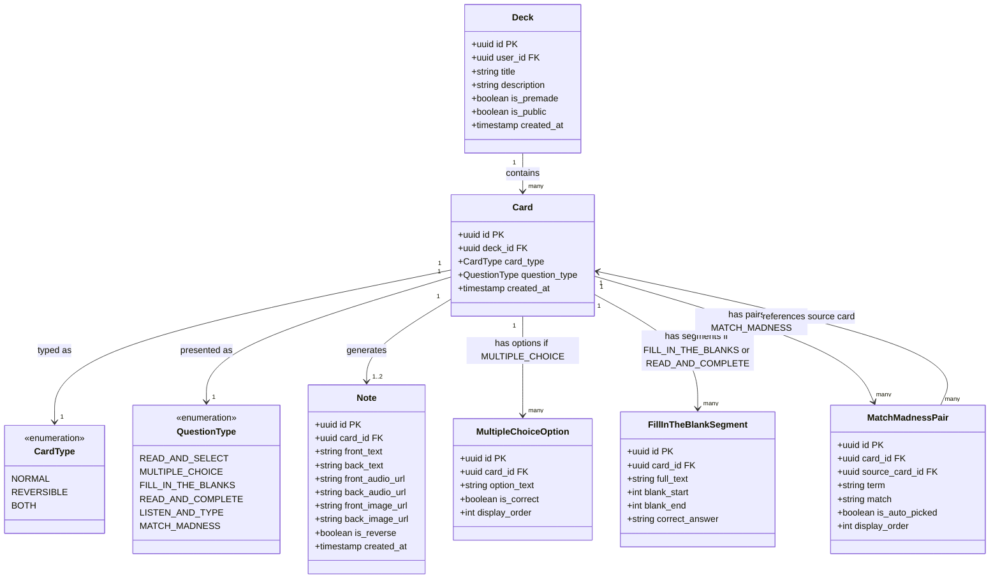

```mermaid
classDiagram

  class Deck {
    +uuid id PK
    +uuid user_id FK
    +string title
    +string description
    +boolean is_premade
    +boolean is_public
    +timestamp created_at
  }

  class Card {
    +uuid id PK
    +uuid deck_id FK
    +CardType card_type
    +QuestionType question_type
    +timestamp created_at
  }

  class CardType {
    <<enumeration>>
    NORMAL
    REVERSIBLE
    BOTH
  }

  class QuestionType {
    <<enumeration>>
    READ_AND_SELECT
    MULTIPLE_CHOICE
    FILL_IN_THE_BLANKS
    READ_AND_COMPLETE
    LISTEN_AND_TYPE
    MATCH_MADNESS
  }

  class Note {
    +uuid id PK
    +uuid card_id FK
    +string front_text
    +string back_text
    +string front_audio_url
    +string back_audio_url
    +string front_image_url
    +string back_image_url
    +boolean is_reverse
    +timestamp created_at
  }

  class MultipleChoiceOption {
    +uuid id PK
    +uuid card_id FK
    +string option_text
    +boolean is_correct
    +int display_order
  }

  class FillInTheBlankSegment {
    +uuid id PK
    +uuid card_id FK
    +string full_text
    +int blank_start
    +int blank_end
    +string correct_answer
  }

  class MatchMadnessPair {
    +uuid id PK
    +uuid card_id FK
    +uuid source_card_id FK
    +string term
    +string match
    +boolean is_auto_picked
    +int display_order
  }

  %% Constraints noted as comments
  %% Card.question_type = MULTIPLE_CHOICE  → MultipleChoiceOption rows exist
  %% Card.question_type = FILL_IN_THE_BLANKS or READ_AND_COMPLETE → FillInTheBlankSegment rows exist
  %% Card.question_type = MATCH_MADNESS → MatchMadnessPair rows exist, Note NOT generated
  %% Card.card_type = NORMAL or REVERSIBLE → 1 Note generated
  %% Card.card_type = BOTH → 2 Notes generated (is_reverse false + true)
  %% Card.question_type = FILL_IN_THE_BLANKS, READ_AND_COMPLETE, MULTIPLE_CHOICE, MATCH_MADNESS → card_type must be NORMAL (cannot reverse)
  %% Card.question_type = LISTEN_AND_TYPE → reversible only if both front and back have audio

  Deck "1" --> "many" Card : contains
  Card "1" --> "1" CardType : typed as
  Card "1" --> "1" QuestionType : presented as
  Card "1" --> "1..2" Note : generates
  Card "1" --> "many" MultipleChoiceOption : has options if MULTIPLE_CHOICE
  Card "1" --> "many" FillInTheBlankSegment : has segments if FILL_IN_THE_BLANKS or READ_AND_COMPLETE
  Card "1" --> "many" MatchMadnessPair : has pairs if MATCH_MADNESS
  MatchMadnessPair "many" --> "1" Card : references source card
```