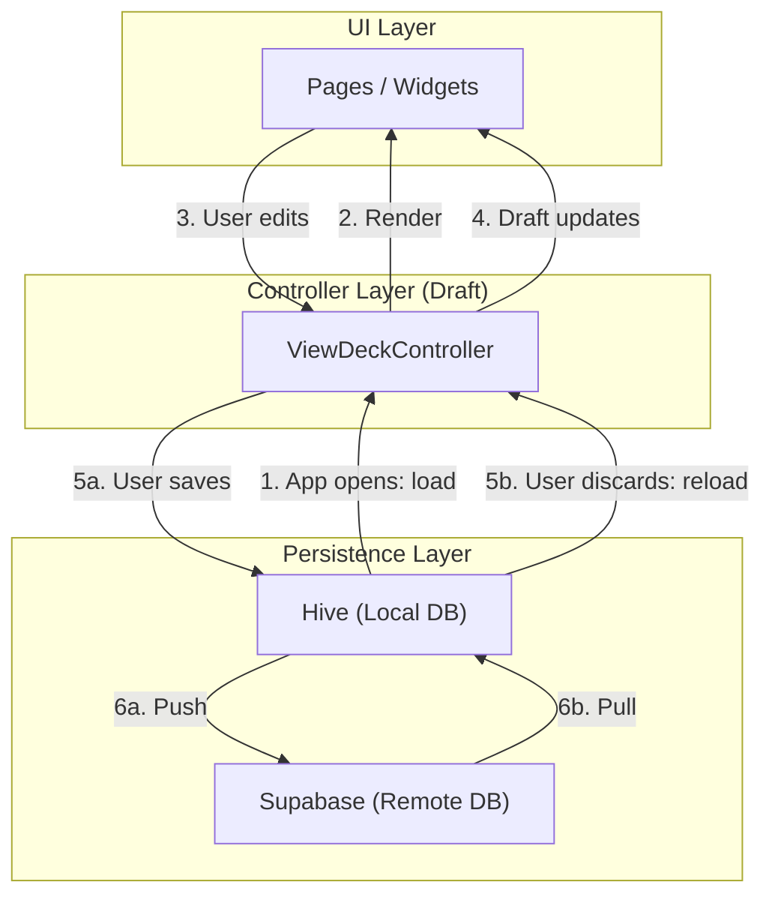
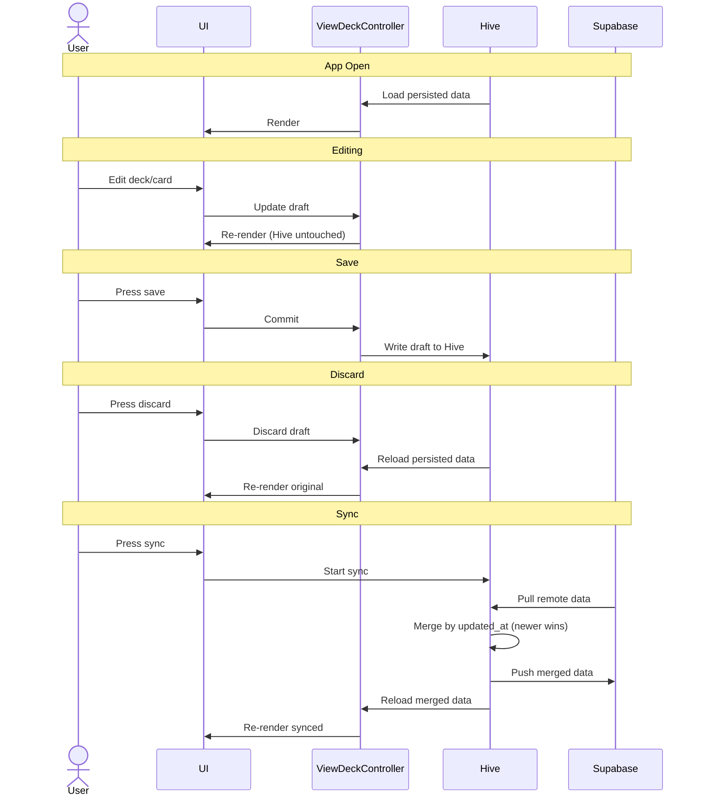
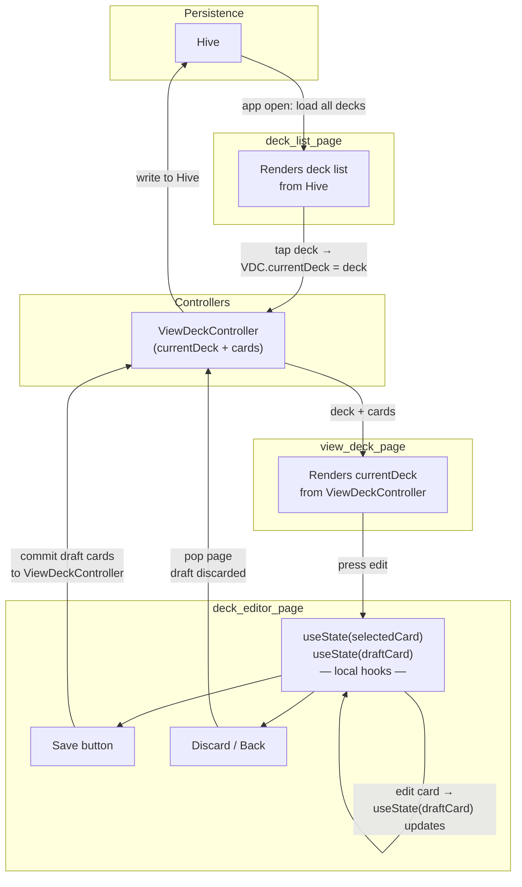

# Local-First Architecture

## Data Flow

```mermaid
flowchart TD
    subgraph UI["UI Layer"]
        Pages["Pages / Widgets"]
    end

    subgraph Controllers["Controller Layer (Draft)"]
        VDC["ViewDeckController"]
    end

    subgraph Persistence["Persistence Layer"]
        Hive["Hive (Local DB)"]
        Supabase["Supabase (Remote DB)"]
    end

    %% App open: Hive loads into controller
    Hive -- "1. App opens: load" --> VDC
    VDC -- "2. Render" --> Pages

    %% User edits: only controller changes
    Pages -- "3. User edits" --> VDC
    VDC -- "4. Draft updates" --> Pages

    %% Save: controller writes to Hive
    VDC -- "5a. User saves" --> Hive

    %% Discard: controller reloads from Hive
    Hive -- "5b. User discards: reload" --> VDC

    %% Sync: Hive <-> Supabase
    Hive -- "6a. Push" --> Supabase
    Supabase -- "6b. Pull" --> Hive
```

## Sync Flow

```mermaid
sequenceDiagram
    actor User
    participant UI
    participant VDC as ViewDeckController
    participant Hive
    participant Supabase

    Note over User,Supabase: App Open
    Hive->>VDC: Load persisted data
    VDC->>UI: Render

    Note over User,Supabase: Editing
    User->>UI: Edit deck/card
    UI->>VDC: Update draft
    VDC->>UI: Re-render (Hive untouched)

    Note over User,Supabase: Save
    User->>UI: Press save
    UI->>VDC: Commit
    VDC->>Hive: Write draft to Hive

    Note over User,Supabase: Discard
    User->>UI: Press discard
    UI->>VDC: Discard draft
    Hive->>VDC: Reload persisted data
    VDC->>UI: Re-render original

    Note over User,Supabase: Sync
    User->>UI: Press sync
    UI->>Hive: Start sync
    Supabase->>Hive: Pull remote data
    Hive->>Hive: Merge by updated_at (newer wins)
    Hive->>Supabase: Push merged data
    Hive->>VDC: Reload merged data
    VDC->>UI: Re-render synced
```

## Navigation Flow (Deck Example)

```mermaid
flowchart TD
    subgraph Persistence
        Hive["Hive"]
    end

    subgraph Controllers
        VDC["ViewDeckController\n(currentDeck + cards)"]
    end

    subgraph DeckList["deck_list_page"]
        DLP["Renders deck list\nfrom Hive"]
    end

    subgraph ViewDeck["view_deck_page"]
        VDP["Renders currentDeck\nfrom ViewDeckController"]
    end

    subgraph EditDeck["deck_editor_page"]
        DEP_hooks["useState(selectedCard)\nuseState(draftCard)\n— local hooks —"]
        DEP_save["Save button"]
        DEP_discard["Discard / Back"]
    end

    %% Load
    Hive -- "app open: load all decks" --> DLP

    %% Select deck
    DLP -- "tap deck →\nVDC.currentDeck = deck" --> VDC
    VDC -- "deck + cards" --> VDP

    %% Edit
    VDP -- "press edit" --> DEP_hooks

    %% Card editing is local to the draft
    DEP_hooks -- "edit card →\nuseState(draftCard) updates" --> DEP_hooks

    %% Save: hooks → ViewDeckController → Hive
    DEP_hooks --> DEP_save
    DEP_save -- "commit draft cards\nto ViewDeckController" --> VDC
    VDC -- "write to Hive" --> Hive

    %% Discard: just pop, hooks die
    DEP_hooks --> DEP_discard
    DEP_discard -- "pop page\ndraft discarded" --> VDC
```
