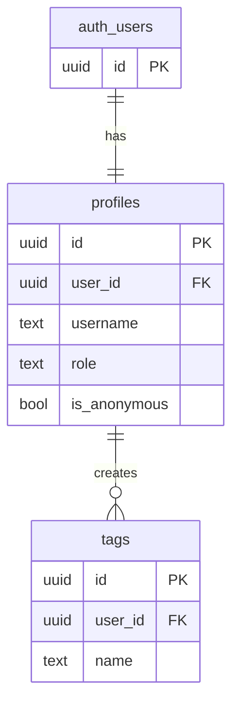
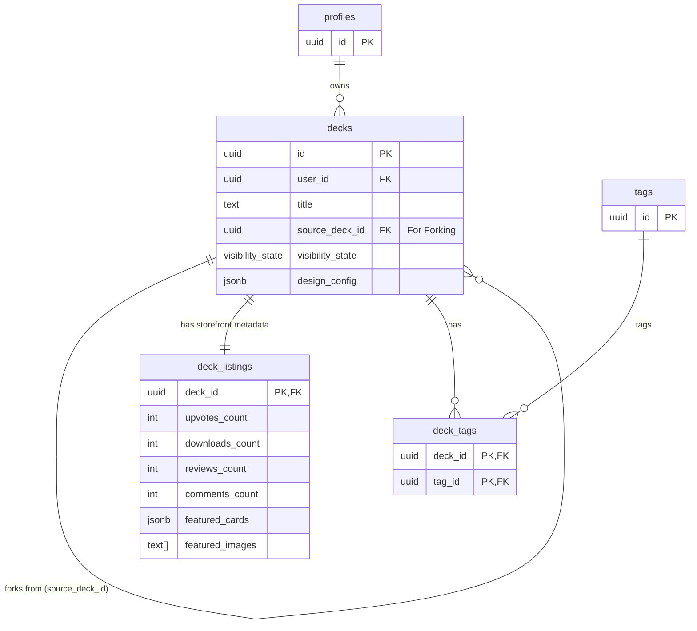
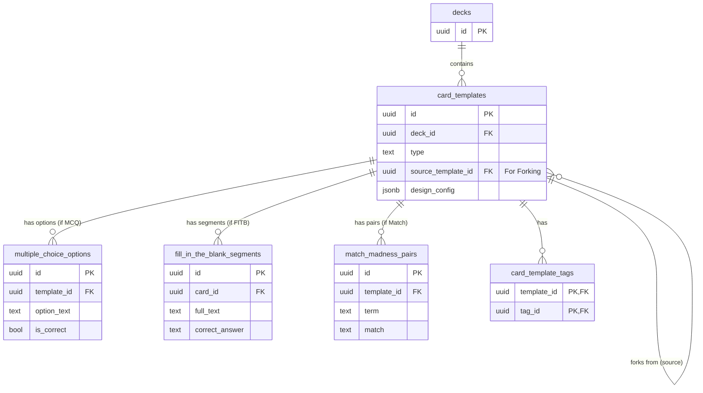
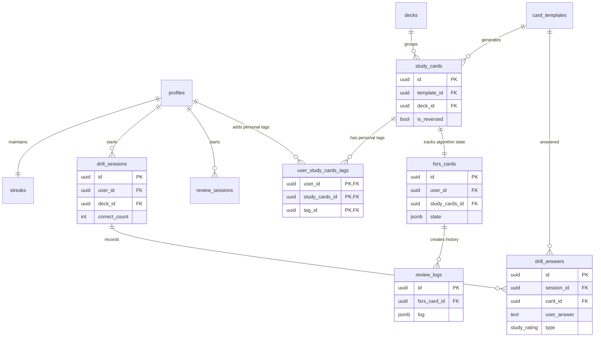
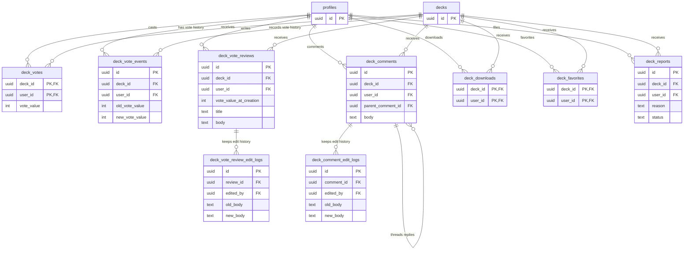
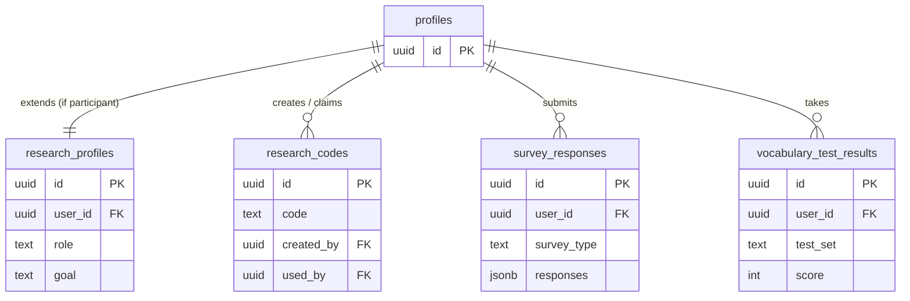

Here are the Entity-Relationship (ER) diagrams for each major system in your V2 database schema. I have broken them down logically so you can visualize how the tables connect within their specific domains.

You can paste these directly into the [Mermaid Live Editor](https://mermaid.live/) or view them natively in markdown viewers that support Mermaid (like GitHub or Notion).

### 1. Core Profiles & Tags Dictionary

This system handles user identities and the global tagging dictionary.

---

### 2. Decks & The Storefront (Listings)

This illustrates the "Git-lite" structure (Decks sourcing from other Decks) and the separation of curriculum data from storefront marketing data.

---

### 3. Card Templates & Question Types

This shows how the core `card_templates` table acts as a parent for specific question-type data, allowing polymorphic relationships.

---

### 4. Local Study Data, Sessions & FSRS Engine

This is the most complex system. It tracks what the user is studying locally, their session drill states, and the FSRS algorithm states.

---

### 5. Tracking & Social Engagement

This maps the interactions users have with the public storefront. Note how they all point back to the parent `decks` table, which triggers updates to `deck_listings`.

---

### 6. Research & Analytics

The isolated tables meant for your A/B testing, demographics, and survey data collection.

